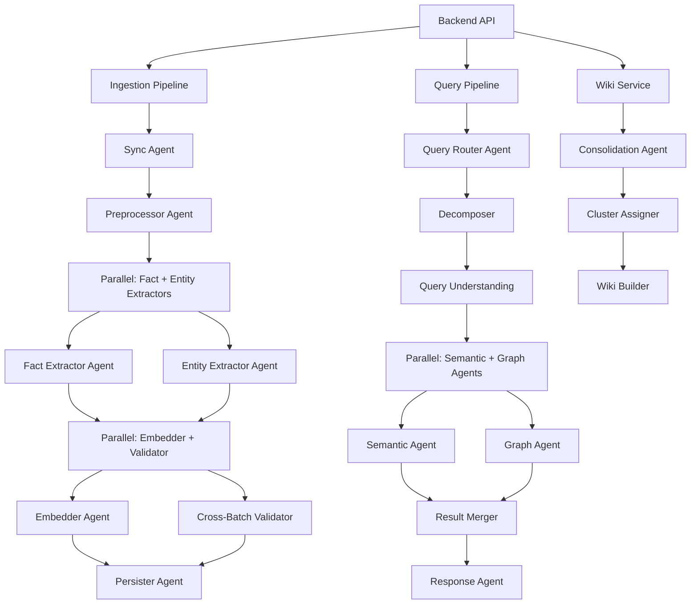

# Agent Architecture

Beever Atlas uses **Google ADK (Agent Development Kit)** to orchestrate complex multi-stage processes. Each major function — ingestion, querying, wiki generation — is implemented as a hierarchy of specialized agents that collaborate to produce results.

<AutoTOC />

## Why Agent-Based Architecture?

Traditional monolithic systems are brittle: one component failure can break the entire pipeline. Agent-based architecture provides:

**Isolation**: Each agent is independently deployable and fault-tolerant

**Parallelism**: Agents can execute simultaneously where possible

**Flexibility**: Agents can be swapped or upgraded independently

**Observability**: Each agent logs its inputs, outputs, and reasoning

**Graceful degradation**: If one agent fails, others can continue with reduced functionality

## Agent Hierarchy Overview

## Ingestion Pipeline Agents

<Accordions>
<Accordion title="Preprocessor Agent">
**Purpose**: Normalize messages from all platforms into a unified format

**Responsibilities**:
- Convert platform-specific formats to `NormalizedMessage`
- Slack mrkdwn → Markdown conversion
- Thread context assembly
- Bot/system message filtering
- Media preprocessing (images, PDFs)

**Tools**: None (local processing)

**Model**: None (deterministic)
</Accordion>
<Accordion title="Fact Extractor Agent">
**Purpose**: Extract atomic facts from messages and media

**LLM**: Gemini 2.0 Flash Lite (primary) → Claude Haiku (fallback)

**Extraction**:
- Parse message content for factual statements
- Extract context from images (via Gemini Vision)
- Parse PDFs for technical details
- Generate 1-2 high-quality facts per message

**Quality Gate**:
- Score each fact (quality ≥ 0.5 to pass)
- Reject vague patterns ("the user", "it was")
- Enforce minimum length (40 characters)

**Output**: List of facts with:
- Content (text)
- Quality score
- Source message metadata
- Extracted timestamp
</Accordion>
<Accordion title="Entity Extractor Agent">
**Purpose**: Extract entities and relationships from messages

**LLM**: Gemini 2.0 Flash Lite (primary) → Claude Haiku (fallback)

**Extraction**:
- Identify entities (Person, Decision, Project, Technology)
- Extract relationships between entities
- Map aliases (Alice, @alice, alice.chen → Alice Chen)
- Capture temporal context (current, supersedes)

**Quality Gate**:
- Entity confidence ≥ 0.6
- Higher thresholds for important relationships (DECIDED: 0.7)
- Filter hypotheticals and sarcasm

**Output**: Structured entities and relationships with:
- Entity type, name, properties
- Relationship type, context, confidence
- Aliases for deduplication
</Accordion>
<Accordion title="Embedder Agent">
**Purpose**: Generate embeddings for semantic search

**Model**: Jina v4 (2048-dim)

**Embeddings**:
- Text vectors for fact content
- Image vectors for visual content
- Doc vectors for PDFs and documents

**Fallback**: If Jina unavailable, queue for backfill and continue with BM25-only

**Output**: Named vectors attached to facts in Weaviate
</Accordion>
<Accordion title="Cross-Batch Validator Agent">
**Purpose**: Resolve entities and validate relationships across message batches

**Responsibilities**:
- Merge entity aliases discovered across chunks
- Validate relationship consistency
- Detect and merge duplicate entities
- Resolve name variants to canonical forms

**Model**: Gemini 2.0 Flash Lite

**Output**: Consolidated entity mappings
</Accordion>
<Accordion title="Persister Agent">
**Purpose**: Write facts and entities to memory systems via outbox pattern

**Responsibilities**:
- Phase 1: Write intent to MongoDB (atomic)
- Phase 2: Fan out to Weaviate and Neo4j
- Handle partial failures with retry
- Mark intents complete

**Tools**:
- `upsert_weaviate_facts` → Weaviate
- `upsert_neo4j_entities` → Neo4j
- `mark_write_intent_status` → MongoDB

**Model**: None (database operations)
</Accordion>
</Accordions>

## Query Pipeline Agents

<Accordions>
<Accordion title="Query Router Agent">
**Purpose**: Decompose complex questions and route to appropriate memory systems

**LLM**: Gemini 2.0 Flash Lite

**Responsibilities**:
- Decompose complex questions into sub-queries
- Classify each sub-query (semantic/graph/both)
- Determine semantic depth (overview/topic/detail)
- Extract entities and topics mentioned

**Output**: Query plan with routed sub-queries

**Fallback**: Regex fast-path classifier if LLM unavailable
</Accordion>
<Accordion title="Decomposer Agent">
**Purpose**: Break complex questions into focused sub-queries

**LLM**: Gemini 2.0 Flash Lite

**Decomposition**:
- Simple questions → 1 internal sub-query
- Complex questions → 2-4 internal + 0-2 external sub-queries
- Parallelizable focused queries

**Output**: Internal and external sub-queries
</Accordion>
<Accordion title="Semantic Agent">
**Purpose**: Retrieve relevant facts from Weaviate

**Tools**:
- `search_weaviate_hybrid` → Hybrid BM25+vector search
- `get_tier0_summary` → Channel overview
- `get_tier1_clusters` → Topic clusters
- `get_tier2_atomics` → Specific facts

**Routing**:
- overview → Tier 0 (cached, FREE)
- topic → Tier 1 → Tier 2 (cached tier, cheap atoms)
- detail → Tier 2 directly (embedding search)

**Output**: Ranked list of relevant facts with citations
</Accordion>
<Accordion title="Graph Agent">
**Purpose**: Traverse Neo4j for entity relationships

**Tools**:
- `traverse_neo4j` → Multi-hop traversal (1-2 hops)
- `temporal_chain` → Decision evolution history
- `fuzzy_match_entities` → Resolve entities from query

**Process**:
1. Resolve query entities to Neo4j nodes
2. Traverse relationships (temporal or standard)
3. Follow episodic edges to Weaviate
4. Fetch full fact text and citations

**Output**: Graph paths + enriched memory content
</Accordion>
<Accordion title="Response Agent">
**Purpose**: Generate grounded answer from retrieved context

**LLM**: Gemini 2.0 Flash (primary) → Claude Sonnet (fallback)

**Responsibilities**:
- Merge results from semantic and graph agents
- Deduplicate by weaviate_id
- Apply temporal decay and quality boosting
- Generate response with citations
- Indicate confidence and uncertainty

**Output**: Formatted answer with:
- Response text
- Citations to source messages
- Confidence score
- Missing information warnings
</Accordion>
</Accordions>

## Wiki Service Agents

<Accordions>
<Accordion title="Consolidation Agent">
**Purpose**: Manage cluster building and wiki refresh

**Sub-agents**:
- Cluster Assigner: Assign facts to clusters
- Health Checker: Evaluate cluster quality

**Triggers**:
- After sync (incremental)
- Daily 2 AM UTC (full rebuild)
- On-demand (manual)

**Responsibilities**:
- Assign new facts to existing or new clusters
- Update cluster summaries
- Rebuild channel summary
- Mark wiki dirty

**Model**: Gemini 2.0 Flash Lite
</Accordion>
<Accordion title="Cluster Assigner Agent">
**Purpose**: Assign facts to topic clusters

**Algorithm**:
1. Get existing clusters for channel
2. For each new fact:
   - Calculate similarity to each cluster
   - If score > 0.6, add to cluster
   - Otherwise, create new cluster seed
3. Promote seeds with 3+ members to clusters

**Output**: Updated cluster assignments
</Accordion>
<Accordion title="Wiki Builder Agent">
**Purpose**: Generate wiki pages from clusters and entities

**LLM**: Gemini 2.0 Flash

**Responsibilities**:
- Generate cluster summaries
- Select key facts (5-10 per cluster)
- Build entity pages (Person, Decision, Project)
- Create cross-references

**Output**: Structured wiki content in Markdown
</Accordion>
</Accordions>

## Agent Communication

### Agent Types

**LlmAgent**: Uses LLM for reasoning (Fact Extractor, Query Router)
- Has system prompt
- Streaming responses
- Tool calling

**SequentialAgent**: Chains agents in sequence (Ingestion Pipeline)
- Output of one agent → Input of next
- Error handling and rollback

**ParallelAgent**: Runs agents simultaneously (Fact + Entity extraction)
- Independent execution
- Merged results

**LoopAgent**: Repeats until condition (Consolidation)
- Iterative processing
- Convergence detection

### Tool Calling

Agents expose tools for other agents to call:

**Semantic Agent Tools**:
- `search_weaviate_hybrid(query, channel_id, alpha)`
- `get_tier0_summary(channel_id)`
- `get_tier1_clusters(channel_id, topic)`

**Graph Agent Tools**:
- `traverse_neo4j(entities, channel_id, max_hops)`
- `temporal_chain(entity_name, channel_id)`
- `fuzzy_match_entities(query, channel_id)`

**Wiki Agent Tools**:
- `assign_to_clusters(channel_id, facts)`
- `build_wiki(channel_id)`

### Fallback Hierarchy

Each agent has a fallback chain:

| Agent | Primary | Fallback | Last Resort |
|-------|---------|----------|-------------|
| Fact Extractor | Gemini Flash Lite | Claude Haiku | Dead letter queue |
| Entity Extractor | Gemini Flash Lite | Claude Haiku | Skip (Weaviate-only) |
| Query Router | Gemini Flash Lite | Claude Haiku | Regex classifier |
| Response Generator | Gemini Flash | Claude Sonnet | Return raw results |
| Wiki Builder | Gemini Flash Lite | Claude Haiku | Serve stale cache |

**Fallback trigger**: 3 consecutive failures or 30s timeout

**Recovery**: Circuit breaker HALF_OPEN after 30s, one probe request

## Error Handling

### Agent-Level

**Retry**: Each agent retries failed operations 3 times with exponential backoff

**Timeout**: Each agent has 30s timeout per operation

**Fallback**: Cascade to fallback model if primary unavailable

**Logging**: All inputs, outputs, and errors logged for debugging

### Pipeline-Level

**Skip non-critical stages**: If entity extraction fails, continue with facts only

**Queue for backfill**: Failed operations queued for retry when dependencies recover

**Circuit breakers**: Open circuit after 3 consecutive failures, auto-recover after 30s

**Partial results**: Return best available results rather than failing completely

## Observability

### Agent Logging

Each agent logs:
- Input parameters (sanitized)
- Output results
- LLM prompts and responses (redacted)
- Tool calls and results
- Errors and retries
- Performance metrics (latency, cost)

### Tracing

Distributed tracing across agent calls:
- Trace ID propagated through all agents
- Spans for each agent execution
- Parent-child relationships for sub-agents
- Timeline view of pipeline execution

### Metrics

Per-agent metrics:
- Invocation count
- Success/failure rate
- Average latency
- Cost per operation
- Fallback rate

## Next Steps

- See **[Ingestion Pipeline](/docs/concepts/ingestion-pipeline)** for agent orchestration details
- Learn about **[Query Router](/docs/concepts/query-router)** agent decision-making
- Understand **[Resilience](/docs/concepts/resilience)** features for fault tolerance
