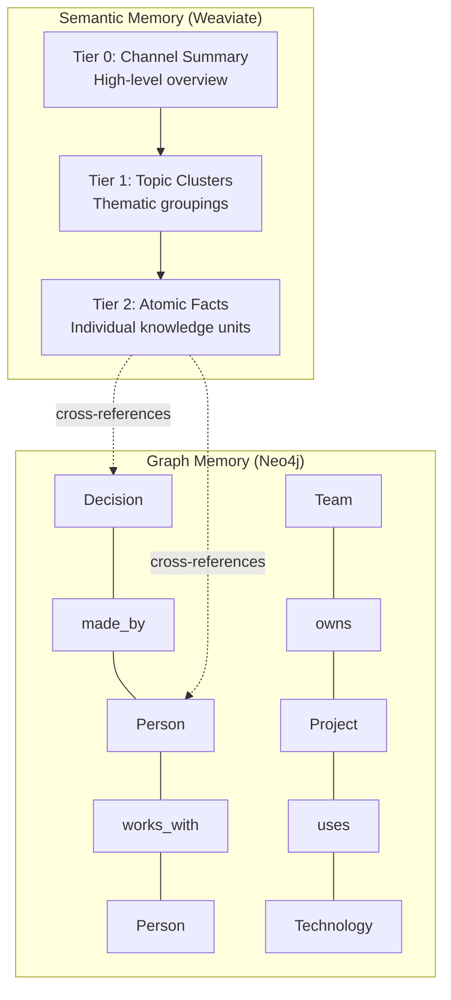

# Dual Memory Architecture

Beever Atlas uses two complementary memory systems that work together to provide comprehensive, context-rich answers. Each system excels at different types of queries, and the query router intelligently combines them when needed.

<AutoTOC />

## Why Two Memory Systems?

A single memory system cannot handle all types of team knowledge questions:

| Question Type | Best Memory System | Why |
|---------------|-------------------|-----|
| "What was discussed about auth?" | Semantic | Factual lookup by meaning |
| "Who decided to use JWT?" | Graph | Person → Decision traversal |
| "Find deployment docs" | Semantic | Content search |
| "What blocks the migration?" | Graph | Project → Blocked by traversal |
| "How did our auth approach evolve?" | Graph | Temporal chain through decisions |
| "Tell me about the JWT migration" | Both | Needs facts + relationships |

**Semantic Memory (Weaviate)** handles ~80% of queries — factual lookups, topical questions, and content retrieval.

**Graph Memory (Neo4j)** handles ~20% of queries — relational questions, temporal evolution, and multi-hop traversals.

These systems are **not redundant**. They each solve problems the other fundamentally cannot:

- Weaviate cannot traverse "Person → works on → Project → has decision → blocked by → Constraint"
- Neo4j cannot do fuzzy semantic search across thousands of facts with cross-modal ranking
- Together, they provide comprehensive understanding of your team's knowledge

## System Overview

## Semantic Memory (Weaviate)

Semantic memory uses a **3-tier hierarchy** optimized for cost-efficient retrieval:

### Tier 0: Channel Summary

High-level overview of what's happening in a channel:

- **Content**: Channel-level summary updated by consolidation service
- **Used for**: "Catch me up", "Overview", "Status update"
- **Access**: FREE (cached, no LLM needed)
- **Update**: After each sync completes

### Tier 1: Topic Clusters

Grouped memories by theme:

- **Content**: Facts grouped into topics (authentication, deployment, API design)
- **Metadata**: Summary, member_ids, topic_tags
- **Used for**: "Tell me about auth", "What about deployment?"
- **Access**: FREE (cached, no LLM needed)
- **Features**:
  - member_ids actually link to Tier 2 atomics (fixed in v2)
  - MERGE-based dedup prevents duplicate clusters
  - Two-stage retrieval (coarse → fine)

### Tier 2: Atomic Facts

Individual knowledge units with full metadata:

- **Content**: Individual facts extracted from messages
- **Features**:
  - Named vectors: text (2048-dim), image, doc (Jina v4)
  - Cross-modal search (text query → find images/PDFs)
  - Quality-scored at extraction (reject < 0.5)
  - Linked to Neo4j via graph_entity_ids
- **Used for**: "What exactly did Alice say?", "Find the diagram"
- **Access**: PAID (uses embedding for search, ~$0.001)

### Cost Optimization

The tier design enables **wiki-first cost optimization**:

| Tier | Access Cost | Query Type |
|------|-------------|------------|
| Tier 0 | FREE | Channel overview |
| Tier 1 | FREE | Topic-level questions |
| Tier 2 | ~$0.001 | Specific fact lookup |
| LLM Synthesis | ~$0.02 | Complex answers |

**Average query cost: ~$0.01** (5x cheaper than competitors)

### Retrieval Features

Semantic memory includes several advanced retrieval features:

**Hybrid Search**: Combines BM25 (keyword) with vector search for optimal relevance

**Temporal Decay**: Older facts gradually score lower, with exemptions for:
- High-importance facts (no decay)
- Decisions/architecture/policies (half decay rate)
- Frequently cited facts (slower decay)

**Quality Boosting**: Higher-quality facts score higher in results

**Semantic Dedup**: Removes near-duplicates across tiers

**Bidirectional Expansion**: Can expand up (to clusters) or down (to atomics) based on result quality

## Graph Memory (Neo4j)

Graph memory captures **relationship meaning** from conversations — things semantic search cannot handle.

### Guided-Flexible Entity Schema

All nodes share a base structure with optional properties:

**Core entity types** (LLM prefers these):
- Person: Individual (name, role, team)
- Decision: Concrete choice (summary, status, rationale, date)
- Project: Initiative (name, status, description)
- Technology: Tool/framework (name, category)

**Extension types** (LLM creates as needed):
- Team, Meeting, Artifact, Constraint, Budget, Deadline, and any other type that emerges from conversations

**Event node** (episodic anchor):
- Links graph entities to source facts in Weaviate
- Enables retrieval of original text + Slack citations
- Preserves provenance for all graph relationships

### Flexible Relationships

The graph uses **descriptive verb phrases** rather than a fixed schema:

**Common patterns**:
- Person `DECIDED` Decision
- Person `WORKS_ON` Project
- Decision `AFFECTS` Project
- Decision `SUPERSEDES` Decision (temporal evolution)
- Decision `BLOCKED_BY` Constraint
- Project `DEPENDS_ON` Project

**Temporal properties** on ALL relationships:
- valid_from: When relationship became valid
- valid_until: When relationship ended (null = currently valid)
- created_at: When relationship was added to graph
- confidence: Extraction confidence score

**Bidirectional edges** (auto-created during ingestion):
- DECIDED ↔ DECIDED_BY
- BLOCKED_BY ↔ BLOCKS
- WORKS_ON ↔ HAS_MEMBER
- OWNS ↔ OWNED_BY

The LLM can create **any relationship type** that captures meaning from your team's conversations. The graph adapts to your organization's patterns.

### Entity Scoping

Global entities (same across all channels):
- **Person**: Alice is Alice everywhere
- **Technology**: React is React everywhere
- **Project**: Project names span channels
- **Team**: Teams span channels

Channel-scoped entities (specific to each channel):
- **Decision**: Decisions are channel-contextual
- **Meeting**: Meetings are channel-contextual
- **Artifact**: Docs are channel-contextual

### Graph Traversal Patterns

**Multi-hop traversal**: Follow relationships 1-3 hops deep
- "Person → works on → Project → has decision → blocked by → Constraint"
- Timeout: 5 seconds max
- Returns: Paths with full relationship context

**Temporal chains**: Track how entities evolve over time
- "Show me how this decision changed"
- Follows SUPERSEDES edges up to 5 hops
- Returns: Ordered evolution chain

**Comprehensive traversal**: Collect all relationships within N hops
- Used for complex queries where relationship types are diverse
- Returns: Structured subgraph for LLM analysis
- Avoids brittleness from pre-filtering edge types

### Episodic Linking (Graph ↔ Weaviate)

Every graph entity connects to its source fact in Weaviate:

1. Graph traversal finds entities and relationships
2. Follow `MENTIONED_IN` edges to Event nodes
3. Event nodes contain `weaviate_id` pointing to source fact
4. Fetch full fact text + Slack citations from Weaviate
5. Combine graph structure with memory content

This ensures **graph queries are grounded** — Neo4j provides structure and relationships, but the actual text and citations always come from Weaviate.

## How They Work Together

### Example 1: Relational Query

**Question**: "Who decided to use JWT and what blocks the implementation?"

1. **Query Router**: Classifies as `route=graph`
2. **Graph Traversal**:
   - Find "JWT" decision node
   - Follow `DECIDED_BY` → Person (Alice)
   - Follow `BLOCKED_BY` → Constraint (missing refresh token rotation)
3. **Episodic Enrichment**:
   - Follow `MENTIONED_IN` edges to Weaviate
   - Retrieve full decision text + Slack citations
4. **Response**: "Alice decided on JWT (citation). The implementation is blocked by missing refresh token rotation (citation)."

### Example 2: Complex Query

**Question**: "Tell me about the authentication migration"

1. **Query Router**: Classifies as `route=both` (facts + relationships)
2. **Parallel Execution**:
   - **Semantic**: Search "authentication migration" → finds facts
   - **Graph**: Traverse from "authentication" decision → related projects, people, blockers
3. **Merge Results**:
   - Deduplicate by weaviate_id
   - Boost cross-validated results (mentioned in both systems)
   - Apply temporal decay
4. **Response**: Comprehensive answer combining:
   - Factual overview (from semantic)
   - Decision history (from graph)
   - Current status and blockers (from graph)
   - All with citations

### Example 3: Temporal Query

**Question**: "How did our deployment strategy evolve?"

1. **Query Router**: Classifies as `route=graph` with `temporal=historical`
2. **Temporal Chain Traversal**:
   - Find "deployment" decision
   - Follow `SUPERSEDES` edges backward in time
   - Returns: [Manual → Shell scripts → Ansible → Terraform → Current]
3. **Episodic Enrichment**: Fetch each decision's rationale from Weaviate
4. **Response**: "Our deployment strategy evolved in 4 phases: Manual (2022), Shell scripts (2023), Ansible (2023), Terraform (2024-present)..."

## Performance Characteristics

| Query Type | Memory System | Cost | Latency |
|------------|---------------|------|---------|
| "What was discussed about X?" | Semantic only | $0.001 | < 200ms |
| "Show me the overview" | Tier 0 (cached) | FREE | < 50ms |
| "Tell me about deployment" | Tier 1 (cached) | FREE | < 50ms |
| "Who decided X?" | Graph only | $0.005 | ~500ms |
| "What is Alice working on?" | Graph only | $0.005 | ~500ms |
| "Tell me about the JWT migration" | Both (parallel) | $0.006 | ~500ms |

## Next Steps

- Learn how the **[Ingestion Pipeline](/docs/concepts/ingestion-pipeline)** populates both memory systems
- See how the **[Query Router](/docs/concepts/query-router)** decides which system to use
- Understand **[Agent Architecture](/docs/concepts/agent-architecture)** that orchestrates both systems
