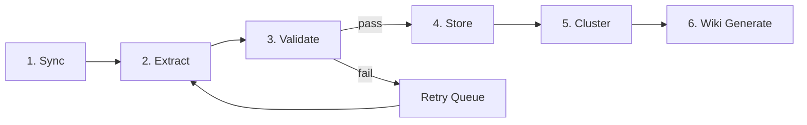

# Ingestion Pipeline

The ingestion pipeline is the heart of Beever Atlas — it transforms raw messages from Slack, Discord, and Teams into structured knowledge that populates both memory systems. Every message passes through **6 stages** before becoming part of your team's knowledge base.

<AutoTOC />

## Pipeline Overview



## Stage 1: Sync

**Purpose**: Fetch messages from chat platforms in a unified format.

**Multi-Platform Adapters** normalize messages from different platforms:

- **Slack**: slack-sdk (Python) — fetches history, threads, reactions, files
- **Discord**: discord.py — fetches messages, attachments, embeds
- **Microsoft Teams**: Microsoft Graph API — fetches messages, replies

All platforms produce a `NormalizedMessage` with:
- Content (text, markdown)
- Author (name, ID, role)
- Channel (ID, name)
- Timestamp
- Thread context
- Attachments (images, PDFs, files)
- Reactions

**Media Processing**:
- Images sent to Gemini Vision for content extraction
- PDFs processed with pypdf (large PDFs chunked into virtual messages)
- Other files indexed by filename and metadata

## Stage 2: Extract

**Purpose**: Use LLMs to extract structured knowledge from messages.

This stage runs **in parallel** for efficiency:

### Fact Extraction (FactExtractorAgent)

Extracts atomic facts from message + media context:

**What it extracts**:
- Factual statements from conversation
- Context from attached images/PDFs
- Action items and decisions
- Technical details and rationale

**Quality Gate**:
- Minimum quality score: 0.5
- Maximum 2 facts per message (prevents over-extraction)
- Rejects vague patterns ("the user", "the process", "it was")
- Requires minimum 40 characters

**Example**:
```
Message: "We're switching to JWT for auth. Alice will implement it next sprint."
→ Facts:
  1. "Team decided to switch from OAuth to JWT for authentication"
  2. "Alice is assigned to implement JWT authentication next sprint"
```

### Entity Extraction (EntityExtractorAgent)

Extracts entities and relationships:

**Core Entity Types** (prefer these):
- Person: Individual (name, role, team)
- Decision: Concrete choice (summary, status, rationale, date)
- Project: Initiative (name, status, description)
- Technology: Tool/framework (name, category)

**Extension Types** (create as needed):
- Team, Meeting, Artifact, Constraint, Budget, Deadline, etc.

**Relationships** (descriptive verb phrases):
- Person `DECIDED` Decision
- Person `WORKS_ON` Project
- Decision `AFFECTS` Project
- Decision `BLOCKED_BY` Constraint
- Any relationship that captures meaning

**Entity Quality Gate**:
- Minimum confidence: 0.6
- Higher thresholds for high-stakes relationships (DECIDED: 0.7, SUPERSEDES: 0.7)
- Filters hypotheticals ("maybe", "might", "could")
- Rejects sarcasm and joking

**Alias Mapping**:
Maps all name variants to canonical form:
- "Alice", "@alice", "alice.chen" → "Alice Chen"
- "Atlas", "beever-atlas", "the atlas project" → canonical project name

## Stage 3: Validate

**Purpose**: Quality gates prevent low-quality data from entering your knowledge base.

### Memory Quality Gate

Filters facts before embedding:

| Criterion | Impact |
|-----------|--------|
| Length < 40 characters | -0.3 |
| Vague patterns ("the user") | -0.2 each |
| Starts with "It/This/That" | -0.15 |
| Has capitalized words (except first) | +0.1 |

**Threshold**: Score ≥ 0.5 to pass

### Entity Quality Gate

Per-relationship confidence thresholds:

| Relationship Type | Min Confidence |
|-------------------|----------------|
| DECIDED | 0.7 |
| OWNS, LEADS | 0.6 |
| BLOCKED_BY | 0.6 |
| SUPERSEDES | 0.7 |
| WORKS_ON | 0.4 |
| MENTIONS | 0.3 |
| MEMBER_OF | 0.4 |
| USES | 0.4 |
| DEPENDS_ON | 0.5 |

**Hypothetical detection**: Threshold raised to 0.8 if message contains "maybe", "might", "could", "should we"

### Cross-Batch Validator

Runs across message batches to:
- Resolve entity aliases (merge "Alice" and "@alice")
- Validate relationship consistency
- Detect and merge duplicate entities

## Stage 4: Store

**Purpose**: Write to Weaviate and Neo4j using the outbox pattern for safety.

### Outbox Pattern

Ensures cross-store write safety:

**Phase 1: Write Intent**
- Create single MongoDB document with:
  - Facts, entities, embeddings
  - Status: `{weaviate: pending, neo4j: pending, state: pending}`
  - Deterministic UUID for idempotency

**Phase 2: Fan Out**
- **Weaviate**: Upsert atomic fact (idempotent via UUID)
  - Mark intent.status.weaviate = "done"
- **Neo4j**: MERGE entities + relationships (idempotent via MERGE)
  - Mark intent.status.neo4j = "done" (skip if Neo4j unavailable)
- **MongoDB**: Update sync state, mark intent complete

**Background Reconciler**:
- Runs every 15 minutes
- Retries incomplete writes
- Max 5 retry attempts per intent

### What Gets Stored

**Weaviate (Semantic Memory)**:
- Atomic facts with full metadata
- Embeddings (text, image, doc vectors)
- Quality scores and temporal validity
- Citations to source messages
- Links to graph entities (graph_entity_ids)

**Neo4j (Graph Memory)**:
- Entities with flexible properties
- Relationships with temporal tracking
- Event nodes linking to Weaviate facts
- Bidirectional edges for traversal

## Stage 5: Cluster

**Purpose**: Group related facts into topics for hierarchical organization.

### Clustering Process

**Incremental Assignment** (after each sync):
1. Get existing clusters for channel
2. For each new fact:
   - Calculate similarity to each cluster
   - If score > 0.6, add to cluster
   - Otherwise, create new cluster seed

**Cluster Promotion**:
- Seed clusters become full clusters when 3+ members accumulate
- Prevents noise from single-fact clusters

### Cluster Health (Daily Full Rebuild)

Runs at 2 AM UTC daily:

| Condition | Action |
|-----------|--------|
| Cluster > 100 members | Split via k-means into 2-3 sub-clusters |
| Two clusters have summary cosine > 0.85 | Merge into single cluster |
| Cluster coherence score < 0.4 | Re-cluster members from scratch |
| Cluster has 0 members | Delete cluster |

### Tier Building

Creates the 3-tier hierarchy:
- **Tier 0**: Channel summary from all clusters
- **Tier 1**: Topic cluster summaries
- **Tier 2**: Atomic facts (linked via member_ids)

## Stage 6: Wiki Generate

**Purpose**: Generate structured wiki pages from clusters and entities.

### Triggers

**After Sync** (incremental):
- Runs automatically when channel sync completes
- Only rebuilds touched clusters

**Daily Rebuild** (full):
- Re-evaluates all clusters for coherence
- Splits/merges as needed
- Rebuilds entire wiki

**On-Demand** (manual):
- Admin trigger via API
- Forces full rebuild

### Wiki Structure

<Files>
  <Folder name="Channel Wiki" defaultOpen>
    <File name="Overview (from Tier 0 summary)" />
    <Folder name="Topics (from Tier 1 clusters)" defaultOpen>
      <Folder name="Authentication" defaultOpen>
        <File name="Summary" />
        <File name="Key Facts" />
        <File name="Related Decisions" />
        <File name="People Involved" />
      </Folder>
      <Folder name="Deployment">
        <File name="Summary" />
        <File name="Key Facts" />
      </Folder>
    </Folder>
    <Folder name="Entities (from Neo4j)" defaultOpen>
      <Folder name="People">
        <Folder name="Alice Chen">
          <File name="Role" />
          <File name="Projects" />
          <File name="Decisions" />
        </Folder>
      </Folder>
      <Folder name="Decisions">
        <Folder name="JWT Authentication">
          <File name="Summary" />
          <File name="Status" />
          <File name="Rationale" />
          <File name="Related Entities" />
        </Folder>
      </Folder>
    </Folder>
  </Folder>
</Files>

### Wiki Dirty Flag

Ensures wiki reflects latest changes:
- Set to `dirty` after: sync, consolidation, entity changes, contradiction resolution
- Checked on each wiki read
- Regenerated if dirty, served from cache if clean

## Quality Configuration

From `.env.example`:

```bash
# Fact Extraction Quality
QUALITY_THRESHOLD=0.5              # Minimum fact quality score
MAX_FACTS_PER_MESSAGE=2            # Prevent over-extraction

# Entity Extraction Quality
ENTITY_THRESHOLD=0.6               # Minimum entity confidence

# Relationship Quality (higher for important relationships)
DECIDED_THRESHOLD=0.7
BLOCKED_BY_THRESHOLD=0.6
SUPERSEDES_THRESHOLD=0.7

# Clustering
CLUSTER_SIMILARITY_THRESHOLD=0.6   # Add to existing cluster
CLUSTER_PROMOTION_MIN_MEMBERS=3    # Promote seed to cluster
CLUSTER_SPLIT_SIZE=100             # Split large clusters
CLUSTER_MERGE_SIMILARITY=0.85      # Merge similar clusters
```

## Resilience Features

### Graceful Degradation

Each stage is independently skippable:

- **Neo4j down**: Skip entity extraction, store facts only
- **Jina down**: Queue embeddings, store text-only
- **Gemini down**: Queue messages for later extraction
- **Weaviate down**: Pause ingestion, queue in MongoDB

### Dead Letter Queue

Failed extractions are queued for retry:
- LLM timeout → retry with smaller batch
- Parse error → retry with simplified prompt
- Max 3 retry attempts before permanent failure

### Backfill Queues

When optional stages fail, work is queued for backfill:
- Entities not extracted → backfill when Neo4j recovers
- Embeddings not generated → backfill when Jina recovers
- Wiki not updated → rebuild on next scheduled run

## Performance

| Stage | Cost | Latency | Parallelizable |
|-------|------|---------|----------------|
| Sync | $0 | Varies (platform API) | Yes (per channel) |
| Extract | ~$0.002/msg | ~1s | Yes (facts + entities) |
| Validate | $0 | `<10ms` | Yes |
| Store | $0 | ~100ms | No (outbox pattern) |
| Cluster | ~$0.001/cluster | ~2s | Yes (per cluster) |
| Wiki | ~$0.01/page | ~5s | Yes (per page) |

**Total ingestion cost**: ~$0.003 per message

**Typical sync** (1000 messages): ~$3, completes in ~5 minutes

## Next Steps

- See how the **[Query Router](/docs/concepts/query-router)** uses this knowledge
- Learn about **[Wiki Generation](/docs/concepts/wiki-generation)** in detail
- Understand **[Agent Architecture](/docs/concepts/agent-architecture)** that orchestrates the pipeline
