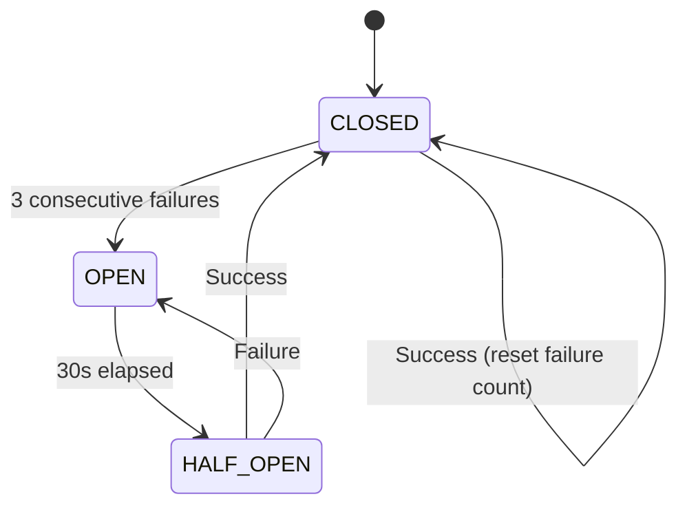

# Resilience & Reliability

Beever Atlas depends on 6 external services (Weaviate, Neo4j, MongoDB, Gemini, Jina, Tavily). A critical design principle is that **any component failure must degrade gracefully** — not cause total system failure.

<AutoTOC />

## Dependency Health Registry

Each external dependency has a **circuit breaker** with three states:

**CLOSED** (healthy): Requests pass through normally

**OPEN** (failing): Requests blocked, system uses fallback

**HALF_OPEN** (probing): Probing for recovery after timeout

### Circuit Breaker States



### Dependency Configuration

| Dependency | Critical | Timeout | Fallback |
|------------|----------|---------|----------|
| **Weaviate** | ✅ Yes | 5s | Serve cached wiki only |
| **Neo4j** | ❌ No | 5s | Semantic-only queries |
| **MongoDB** | ✅ Yes | 5s | Read-only from cache |
| **Gemini** | ✅ Yes | 10s | Claude via LiteLLM |
| **Jina** | ❌ No | 10s | BM25-only search |
| **Tavily** | ❌ No | 5s | Internal-only results |
| **Redis** | ❌ No | 2s | Chat SDK bot offline |

**Critical dependencies**: System severely degraded but still functional
**Non-critical**: Degraded mode with reduced functionality

## Degradation Matrix

When components fail, Beever Atlas degrades predictably:

| Component Down | Ingestion Impact | Query Impact | User Experience |
|----------------|-----------------|--------------|-----------------|
| **Neo4j** | Entity extraction skipped; facts stored in Weaviate only | `route=graph` → reclassified as `route=semantic` | Wiki People/Decisions show "temporarily unavailable" |
| **Gemini** | Messages queued in dead letter queue | ADK agents fall back to Claude models | Alert fired; retry on recovery |
| **Redis** | No impact (batch ingestion unaffected) | No impact (MCP queries unaffected) | Chat SDK bot offline; users see "bot unavailable" |
| **Jina** | Embeddings queued; facts stored text-only | Existing embeddings work; new facts use BM25-only | Backfill embeddings when Jina recovers |
| **Tavily** | No impact | Silently drop external sub-queries | User sees "external search unavailable" note |
| **Weaviate** | Full ingestion paused (queue in MongoDB) | Return cached wiki; graph-only for relational queries | Critical alert — system severely degraded |
| **MongoDB** | Full system paused | Read-only from Weaviate/Neo4j if cached connections survive | Critical alert — system offline |

## LLM Fallback

All LLM calls use **Google ADK** with **LiteLLM** integration for model fallback:

### Primary → Fallback Chain

| Agent Tier | Primary | Fallback | Last Resort |
|-----------|---------|----------|-------------|
| Fast (routing, extraction) | Gemini 2.0 Flash Lite | Claude Haiku | Regex fast-path |
| Quality (response, wiki) | Gemini 2.0 Flash | Claude Sonnet | Return raw results |

### Per-Agent Fallback

| ADK Agent | Primary | Fallback | Last Resort |
|-----------|---------|----------|-------------|
| `query_router_agent` | Gemini Flash Lite | Claude Haiku | Regex classifier |
| `fact_extractor_agent` | Gemini Flash Lite | Claude Haiku | Dead letter queue |
| `entity_extractor_agent` | Gemini Flash Lite | Claude Haiku | Skip (Weaviate-only) |
| `response_agent` | Gemini Flash | Claude Sonnet | Return raw results |
| `consolidation_agent` | Gemini Flash Lite | Claude Haiku | Serve stale cache |

**Fallback trigger**: 3 consecutive failures OR 30s timeout

**Recovery**: Circuit breaker HALF_OPEN after 30s, probe with one request

## Ingestion Pipeline Resilience

Each pipeline stage is **independently skippable**:

### Stage-Level Skips

```python
async def ingest_message(msg: NormalizedMessage):
    # Stage 1: Preprocess (required)
    preprocessed = await preprocessor.process(msg)
    
    # Stage 2a: Extract facts (required — queue to DLQ on failure)
    try:
        facts = await extractor.extract(preprocessed)
    except LLMUnavailableError:
        await dead_letter_queue.enqueue(msg)
        return
    
    # Stage 2b: Entity extraction (optional — skip if Neo4j/LLM down)
    entities = []
    if await health.check("neo4j") and await health.check("gemini"):
        try:
            entities = await entity_extractor.extract(preprocessed, facts)
        except Exception as e:
            logger.warning(f"Entity extraction failed, continuing: {e}")
            await backfill_queue.enqueue("entities", msg.id, preprocessed)
    
    # Stage 3: Embed (optional — queue if Jina down)
    embeddings = None
    if await health.check("jina"):
        embeddings = await embedder.embed(facts)
    else:
        await backfill_queue.enqueue("embeddings", msg.id, facts)
    
    # Stage 4: Persist via outbox pattern
    await persister.persist(facts, entities, embeddings)
```

### Backfill Queues

Failed optional stages are queued for backfill:

**Entities not extracted**: Queued when Neo4j or LLM unavailable
- Backfilled when both dependencies recover
- Processed in order by timestamp

**Embeddings not generated**: Queued when Jina unavailable
- Backfilled when Jina recovers
- Processed in batches of 100

**Wiki not updated**: Rebuild on next scheduled run
- No data loss (facts already stored)
- Wiki regenerates from complete memory

## Write Safety — Outbox Pattern

Cross-store writes use the **outbox pattern** for safety:

### Two-Phase Persist

**Phase 1: Write Intent**
```python
# Atomic write to MongoDB
intent = WriteIntent(
    id=deterministic_uuid(facts),
    facts=facts,
    entities=entities,
    embeddings=embeddings,
    status={
        "weaviate": "pending",
        "neo4j": "pending" if entities else "skipped",
        "state": "pending"
    },
    retry_count=0
)
await mongo.write_intents.insert_one(intent.dict())
```

**Phase 2: Fan Out**
```python
# Weaviate — idempotent via deterministic UUID
if intent.status["weaviate"] == "pending":
    try:
        await weaviate.upsert(intent.facts, intent.embeddings)
        await mark(intent.id, "weaviate", "done")
    except Exception:
        await mark(intent.id, "weaviate", "failed")

# Neo4j — idempotent via MERGE semantics
if intent.status["neo4j"] == "pending":
    try:
        for entity in intent.entities:
            await neo4j.upsert_entity(entity)
        await mark(intent.id, "neo4j", "done")
    except Exception:
        await mark(intent.id, "neo4j", "failed")

# MongoDB sync state — final step
await update_sync_state(intent)
await mark(intent.id, "state", "done")
```

### Background Write Reconciler

Runs every 15 minutes to retry incomplete writes:

```python
async def reconcile():
    stale = await mongo.write_intents.find({
        "$or": [
            {"status.weaviate": {"$in": ["pending", "failed"]}},
            {"status.neo4j": {"$in": ["pending", "failed"]}}
        ],
        "created_at": {"$lt": now() - timedelta(minutes=5)},
        "retry_count": {"$lt": 5}
    }).to_list()
    
    for intent in stale:
        await fan_out(WriteIntent(**intent))
        await mongo.write_intents.update_one(
            {"id": intent["id"]},
            {"$inc": {"retry_count": 1}}
        )
```

**Max retries**: 5 attempts before permanent failure

**Timeout**: Abandoned after 24 hours

## Query Resilience

### Query Router Fallbacks

**Graph timeout**: Fall back to semantic-only
```python
try:
    graph_results = await graph_agent.traverse(entities)
except TimeoutError:
    logger.warning("Graph traversal timed out, using semantic-only")
    graph_results = []
```

**Both systems down**: Return cached wiki
```python
if not await health.check("weaviate") and not await health.check("neo4j"):
    cached = await wiki_cache.get(channel_id)
    if cached:
        return cached
    return {"error": "System temporarily unavailable"}
```

**External search failure**: Return internal-only results
```python
try:
    external = await tavily.search(query)
except Exception:
    logger.warning("External search failed, using internal-only")
    external = None
```

### Graceful Degradation

| Scenario | Behavior |
|----------|----------|
| Neo4j timeout | Use semantic-only results (no graph context) |
| Weaviate timeout | Use graph-only results (no factual context) |
| Both timeout | Return cached wiki if available |
| LLM timeout | Return raw retrieved results |
| External search timeout | Return internal-only results with note |

## Error Recovery Strategies

### Automatic Recovery

**Circuit breaker**: Automatically closes after successful probe request

**Backfill processing**: Automatic on dependency recovery

**Retry queues**: Processed in order with exponential backoff

**Dead letter queue**: Manual inspection required after 5 failures

### Manual Recovery

**Admin API endpoints**:
```bash
# Retry failed writes
POST /api/admin/reconcile

# Rebuild wiki for channel
POST /api/admin/wiki/rebuild
{ "channel_id": "C123456" }

# Refresh ACL for user
POST /api/admin/acl/refresh
{ "user_id": "U123456" }

# Trigger backfill
POST /api/admin/backfill/:type
# types: entities, embeddings
```

### Monitoring

**Health check endpoint**:
```bash
GET /api/health
{
  "status": "degraded",
  "dependencies": {
    "weaviate": "healthy",
    "neo4j": "failing",
    "mongodb": "healthy",
    "gemini": "healthy",
    "jina": "degraded",
    "tavily": "healthy"
  },
  "uptime": 99.5,
  "degraded_since": "2026-04-13T12:00:00Z"
}
```

**Alerts**:
- Critical dependencies down → PagerDuty alert
- Non-critical dependencies down → Slack notification
- High failure rate → Warning alert
- Circuit breaker opens → Info log

## Operational Impact

### User Experience During Failures

<Accordions>
<Accordion title="Neo4j down">
- ✅ Factual queries work
- ❌ Relational queries fail with clear message
- ⚠️ Wiki entity pages show "temporarily unavailable"
</Accordion>
<Accordion title="Gemini down">
- ✅ Queries work (fallback to Claude)
- ⚠️ Ingestion pauses (messages queued)
- ✅ Wiki serves cached content
</Accordion>
<Accordion title="Weaviate down">
- ❌ Ingestion paused
- ⚠️ Queries return cached wiki only
- ❌ No new content until recovery
</Accordion>
<Accordion title="MongoDB down">
- ❌ Full system offline
- ❌ No ingestion or queries
- 🚨 Critical alert
</Accordion>
</Accordions>

### Recovery Time Objectives

| Component | RTO (Recovery Time) | RPO (Data Loss) |
|-----------|---------------------|-----------------|
| Neo4j | < 5 min | 0 min (queued) |
| Gemini | < 1 min (auto fallback) | 0 min (queued) |
| Jina | < 15 min (backfill) | 0 min (queued) |
| Weaviate | < 15 min | < 5 min (queued) |
| MongoDB | < 15 min | < 5 min (queued) |

## Best Practices

### For Operators

**Monitor circuit breakers**: Set up alerts for OPEN state

**Check reconciliation**: Review reconciler logs for failed writes

**Test failover**: Regularly test dependency failure scenarios

**Plan capacity**: Ensure backfill queues don't grow unbounded

**Document runbooks**: Step-by-step recovery procedures

### For Users

**Expect degraded service**: Some features unavailable during outages

**Check status page**: Real-time system status at `/status`

**Use cached wiki**: Wiki content available even during outages

**Report issues**: Slack channel for system status updates

## Next Steps

- Learn about **[Agent Architecture](/docs/concepts/agent-architecture)** for agent-level resilience
- See **[Ingestion Pipeline](/docs/concepts/ingestion-pipeline)** for pipeline-level fault tolerance
- Understand **[Query Router](/docs/concepts/query-router)** for query-level fallbacks
