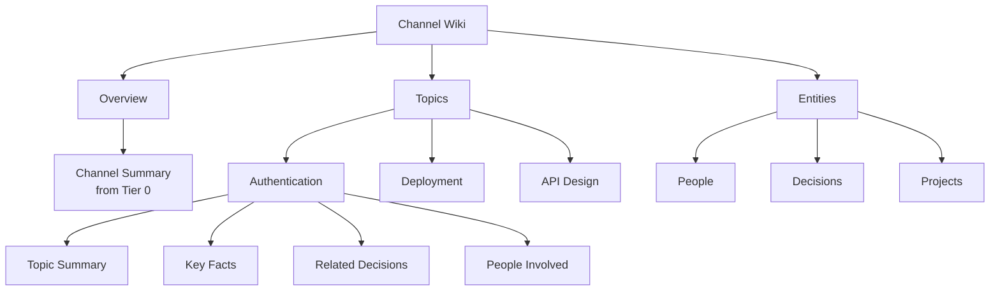

# Wiki Generation

Beever Atlas automatically transforms your team conversations into a persistent, browsable wiki. Unlike traditional wikis that require manual editing, Beever Atlas wiki pages are generated from your structured memory and kept up-to-date as conversations continue.

<AutoTOC />

## Why Auto-Generated Wiki Matters

Traditional wikis suffer from three problems:

1. **Manual maintenance burden**: Someone must write and update pages
2. **Stale content**: Wikis quickly become outdated as no one updates them
3. **Incomplete coverage**: Only formally documented knowledge makes it in

Beever Atlas solves all three:

- **Zero maintenance**: Wiki pages auto-generate from conversations
- **Always up-to-date**: Pages update when new messages arrive
- **Complete coverage**: Everything discussed is captured

## Wiki Hierarchy

The wiki structure mirrors the 3-tier semantic memory hierarchy:



### Level 1: Channel Overview

High-level summary of the entire channel:

**Source**: Tier 0 semantic memory (channel summary)

**Content**:
- What this channel is about
- Recent activity overview
- Key themes and topics
- Important decisions or changes

**Update frequency**: After each channel sync

**Example**:
```markdown
# #engineering Overview

The engineering team discusses architecture decisions, 
deployment strategies, and technical implementation.

**Recent activity**:
- Decided to migrate from OAuth to JWT for authentication
- Planning database migration for Q2
- Evaluating Terraform for infrastructure

**Key themes**: Authentication, Deployment, Infrastructure
```

### Level 2: Topic Pages

Grouped knowledge about specific themes:

**Source**: Tier 1 semantic memory (topic clusters)

**Content**:
- Topic summary
- Key facts (5-10 most relevant)
- Related decisions
- People involved
- Related projects

**Update frequency**: Incremental after sync, full rebuild daily

**Example**:
```markdown
# Authentication

## Summary
The team uses JWT with RS256 for API authentication. 
Migrated from OAuth in January 2026.

## Key Facts
- Decision: Switch from OAuth to JWT for stateless auth (Jan 15)
- Implementation: Alice assigned to implement JWT (Jan 16)
- Security: RS256 algorithm chosen for key rotation support (Jan 17)

## Related Decisions
- [JWT Authentication Decision](/decisions/jwt-auth)

## People Involved
- [Alice Chen](/people/alice-chen) - Implementation lead
- [Bob Smith](/people/bob-smith) - Security review

## Related Projects
- [API v2 Migration](/projects/api-v2)
```

### Level 3: Entity Pages

Dedicated pages for people, decisions, projects, and technologies:

**Source**: Neo4j graph memory

**Content**:
- Entity details
- Related entities
- Temporal evolution
- Source conversations

**Update frequency**: After entity extraction changes

**Example (Person)**:
```markdown
# Alice Chen

**Role**: Senior Software Engineer
**Team**: Backend Platform

## Projects
- [API v2 Migration](/projects/api-v2) - Lead
- [JWT Authentication](/decisions/jwt-auth) - Implementation

## Recent Decisions
- Decided to use JWT with RS256 (Jan 15)
- Proposed Terraform for infrastructure (Jan 10)

## Relationships
- Works on: API v2 Migration
- Decided: JWT Authentication
- Member of: Backend Platform team
```

**Example (Decision)**:
```markdown
# JWT Authentication Decision

**Status**: ✅ Implemented
**Date**: January 15, 2026
**Decided by**: Alice Chen

## Summary
Replace OAuth with JWT for stateless authentication.
Uses RS256 for key rotation support.

## Rationale
- OAuth requires session store, JWT is stateless
- RS256 allows non-repudiation and key rotation
- Simpler integration with microservices

## Evolution
- **Jan 15**: Initial decision to use JWT
- **Jan 17**: Confirmed RS256 algorithm (supersedes HS256 proposal)
- **Feb 1**: Implementation completed

## Related Entities
- **Blocks**: Refresh token rotation (pending)
- **Supersedes**: OAuth Authentication Decision
- **Used by**: API v2 Migration
```

## Generation Triggers

Wiki pages generate on three triggers:

### 1. After Sync (Incremental)

**When**: Automatically after each channel sync completes

**What**:
- Assign new facts to existing or new clusters
- Update touched cluster summaries
- Update channel summary
- Mark wiki as dirty

**Cost**: ~$0.01 per 100 new messages

**Latency**: ~10 seconds for typical sync

### 2. Daily Full Rebuild

**When**: 2 AM UTC every day

**What**:
- Re-evaluate all clusters for coherence
- Split clusters > 100 members
- Merge clusters with similarity > 0.85
- Rebuild cluster summaries
- Full wiki regeneration

**Purpose**: Ensures long-term quality and coherence

**Cost**: ~$0.50 per channel with 10,000 messages

### 3. On-Demand (Manual)

**When**: Triggered via API by admin

**What**:
- Force full cluster reconsolidation
- Rebuild entire wiki
- Update all entity pages

**Use cases**:
- After bulk import of historical messages
- After changing clustering parameters
- To fix quality issues

**API**:
```bash
POST /api/admin/wiki/rebuild
{
  "channel_id": "C123456",
  "force": true
}
```

## Wiki Components

### Summaries

Generated by LLM from clustered facts:

**Channel Summary**:
- Input: All cluster summaries
- Output: High-level channel overview
- Length: 2-3 paragraphs

**Cluster Summary**:
- Input: Cluster member facts
- Output: Topic overview
- Length: 1-2 paragraphs

**Cost**: ~$0.01 per summary

### Key Facts Selection

Top 5-10 facts per cluster, ranked by:

1. **Quality score**: Higher-quality facts preferred
2. **Temporal decay**: Recent facts boosted (except decisions)
3. **Citation count**: Frequently cited facts boosted
4. **Importance**: High/critical importance always included

**Exemptions from decay**:
- Decisions, architecture, policies (slow decay)
- High/critical importance (no decay)
- Frequently cited (reinforced)

### Cross-References

Automatic linking between related content:

**Topic → Decisions**:
- Decision entities mentioned in topic facts
- Links to decision pages

**Topic → People**:
- People entities mentioned in topic facts
- Links to person pages

**Decision → Projects**:
- Projects affected by decision
- Links to project pages

**Entity → Facts**:
- Source conversations mentioning entity
- Links to relevant message clusters

## Browsing the Wiki

### Web Dashboard

The web UI provides wiki browsing:

**Navigation**:
- Channel list → Select channel → Browse wiki
- Topic tree → Expand topics → View facts
- Entity index → Browse people, decisions, projects

**Search**:
- Full-text search across wiki content
- Filter by topic, entity type, date range
- Semantic search ("find decisions about auth")

**Citations**:
- Every fact links to source message
- Jump directly to Slack/Discord/Teams
- View full conversation context

### API Access

Wiki content available via REST API:

```bash
# Get channel wiki
GET /api/wiki/:channel_id

# Get topic page
GET /api/wiki/:channel_id/topics/:topic_id

# Get entity page
GET /api/wiki/entities/:entity_type/:entity_id
```

## Wiki Quality

### Cluster Health Rules

Applied during daily full rebuild:

| Condition | Action | Rationale |
|-----------|--------|-----------|
| Cluster > 100 members | Split via k-means | Too broad, needs subdivision |
| Similarity > 0.85 | Merge clusters | Duplicates or near-duplicates |
| Coherence < 0.4 | Re-cluster | Lost coherence over time |
| 0 members | Delete cluster | Empty cluster |

### Quality Metrics

**Cluster Coherence**:
- Average pairwise similarity of members
- Target: > 0.4
- Below threshold → re-cluster from scratch

**Summary Quality**:
- LLM-rated for relevance and completeness
- Poor summaries regenerated
- Target: > 0.7 quality score

**Coverage**:
- Percentage of facts assigned to clusters
- Target: > 95%
- Unclustered facts flagged for review

## Cost Optimization

The wiki is designed for cost efficiency:

**Read Costs**:
- Cached wiki pages = FREE
- No LLM calls to serve cached content
- Cache hit rate: > 80% for typical traffic

**Write Costs**:
- Incremental updates: ~$0.01 per 100 messages
- Daily rebuild: ~$0.50 per 10K messages
- Amortized cost: ~$0.001 per message per day

**Optimization**:
- Dirty flag prevents unnecessary regeneration
- Differential updates only touch changed clusters
- Batch processing for large syncs

## Comparison to Traditional Wikis

| Aspect | Traditional Wiki (Confluence/Notion) | Beever Atlas Wiki |
|--------|--------------------------------------|-------------------|
| **Content creation** | Manual writing | Auto-generated from chat |
| **Maintenance** | High (manual updates) | Zero (auto-updates) |
| **Freshness** | Stales quickly | Always up-to-date |
| **Coverage** | Limited to documented topics | Everything discussed |
| **Consistency** | Varies by author | Consistent LLM generation |
| **Cost** | Editor time | ~$0.001/message/day |
| **Temporal tracking** | Manual page history | Automatic evolution chains |
| **Relationships** | Manual links | Auto-generated from graph |

## Next Steps

- See the **[Ingestion Pipeline](/docs/concepts/ingestion-pipeline)** that populates the wiki
- Learn about the **[Dual Memory Architecture](/docs/concepts/dual-memory)** that enables wiki generation
- Understand **[Query Router](/docs/concepts/query-router)** that uses the wiki for fast answers
