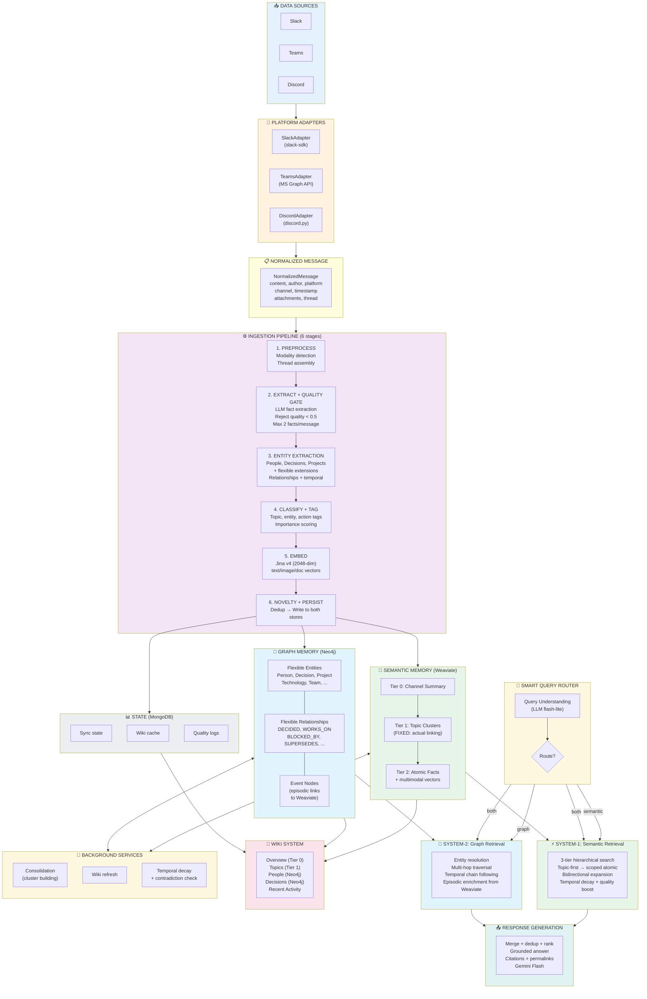
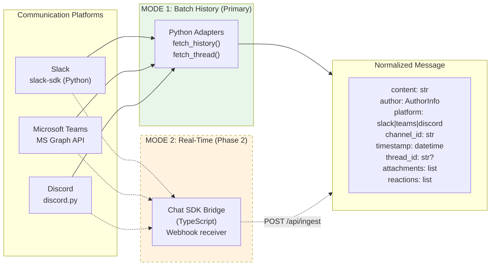
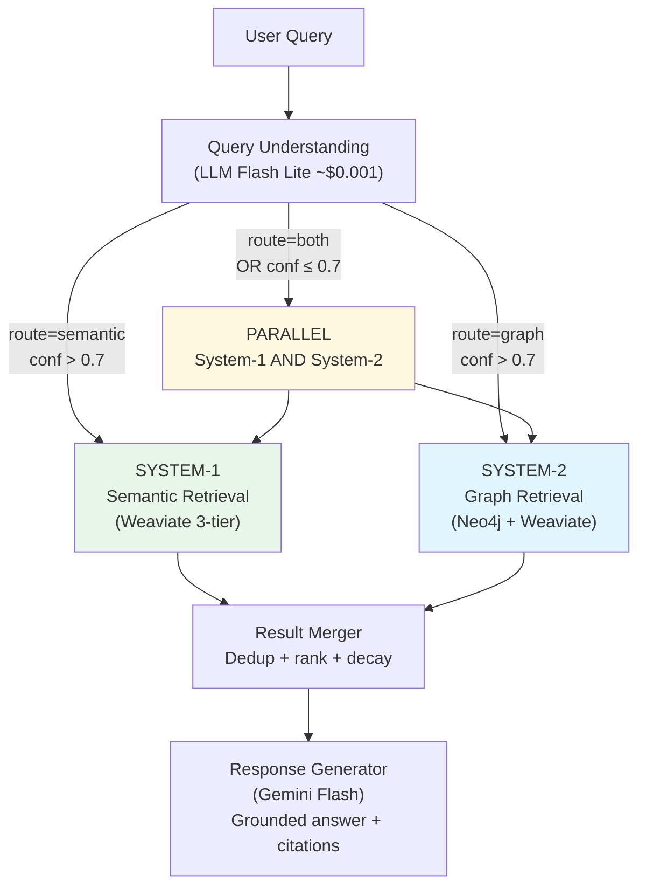
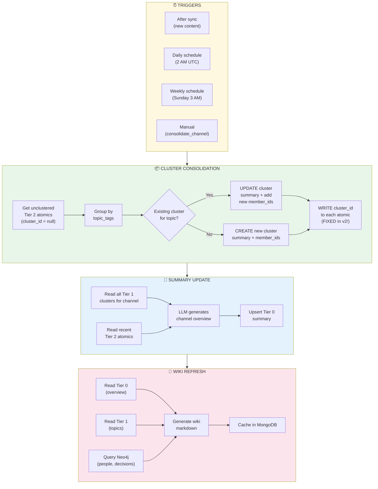
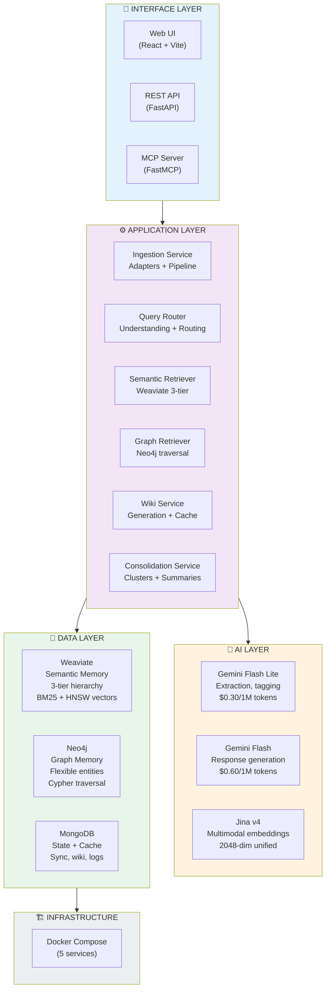

# Beever Atlas v2: Comprehensive Architecture Overview

> **For**: Development Team, Product Team, Stakeholders
> **Purpose**: Complete technical reference for the v2 dual-memory architecture
> **Related**: `TECHNICAL_PROPOSAL.md` (design decisions), `WEAKNESS_RESOLUTION_MAP.md` (v1 fixes), `REFERENCE_PAPERS.md` (research basis)

---

## TL;DR: What Changed from v1 to v2?

```
┌──────────────────────────────────────────────────────────────────────────────┐
│                          v1 (DEMO) vs v2 (PRODUCTION)                        │
├──────────────────────────────────────────────────────────────────────────────┤
│                                                                               │
│  v1: Single Memory System (Weaviate only)                                    │
│  ┌──────────┐     ┌──────────┐     ┌──────────┐                             │
│  │  Query   │ ──▶ │ Weaviate │ ──▶ │   LLM    │                             │
│  └──────────┘     │ (broken  │     └──────────┘                             │
│                    │ clusters)│                                               │
│                    └──────────┘                                               │
│  Problems: cluster linking no-op, regex classifier, no temporal decay,      │
│  no relational queries, Slack only, 5.25/10 memory quality                  │
│                                                                               │
│  ─────────────────────────────────────────────────────────────────────────── │
│                                                                               │
│  v2: Dual Memory System (Weaviate + Neo4j)                                  │
│  ┌──────────┐     ┌──────────────┐     ┌──────────┐                         │
│  │  Query   │ ──▶ │ Smart Router │ ──▶ │ Response │                         │
│  └──────────┘     └──────┬───────┘     └──────────┘                         │
│                     ┌────┴─────┐                                             │
│                     ▼          ▼                                             │
│               ┌──────────┐ ┌──────────┐                                     │
│               │ Weaviate │ │  Neo4j   │                                     │
│               │ (fixed   │ │ (graph   │                                     │
│               │ 3-tier)  │ │ memory)  │                                     │
│               └──────────┘ └──────────┘                                     │
│  Adds: graph relationships, temporal evolution, flexible entities,          │
│  multi-platform, LLM query understanding, quality gates, all v1 fixes      │
│                                                                               │
└──────────────────────────────────────────────────────────────────────────────┘
```

**Key differentiators from competitors (memU, Mem0, Zep, MemGPT):**

| Capability | Competitors | Beever Atlas v2 |
|------------|------------|-----------------|
| Wiki-first (FREE reads) | Every query = LLM call | 80% free via cached wiki |
| Dual memory (semantic + graph) | Single memory model | Weaviate for facts + Neo4j for relationships |
| Cross-modal search | Text only (mostly) | Text query → finds images, PDFs, videos |
| Temporal evolution | Limited | Bi-temporal + SUPERSEDES chains in graph |
| Flexible entity types | Fixed or none | LLM creates any entity/relationship type |
| Multi-platform | Single platform | Slack, Teams, Discord via adapter layer |
| Quality-gated ingestion | Accept everything | Reject < 0.5 quality score |

---

## Part 1: The Complete System — Full Picture



---

## Part 2: Multi-Platform Ingestion

### How Messages Enter the System



**Mode 1 (Python Adapters)** is the primary ingestion path. Each adapter fetches message history via platform-specific APIs and normalizes to `NormalizedMessage`.

**Mode 2 (Chat SDK)** is optional for real-time. The [Vercel Chat SDK](https://chat-sdk.dev/) is TypeScript-only and can receive webhooks but cannot fetch history. It runs as a separate Docker service that forwards normalized events to the Python backend.

### Adapter Data Model

```python
@dataclass
class NormalizedMessage:
    content: str                            # Message text
    author: AuthorInfo                      # id, name, email, role, platform
    platform: Platform                      # slack | teams | discord
    channel_id: str                         # Platform channel ID
    channel_name: str                       # Human-readable name
    message_id: str                         # Platform message ID
    timestamp: datetime                     # When sent
    thread_id: str | None = None            # Parent thread (if reply)
    attachments: list[Attachment] = []      # Files: id, name, type, url
    reactions: list[str] = []               # Emoji reactions
    reply_count: int = 0                    # Thread reply count
    raw_metadata: dict = {}                 # Platform-specific extras
```

---

## Part 3: The Ingestion Pipeline (How Memories Are Created)

Every `NormalizedMessage` passes through 6 stages. Stages 2 and 3 use LLM. The pipeline writes to **both** Weaviate and Neo4j.

```
NormalizedMessage
     │
     ▼
┌─────────────────────────────────────────────────────────────────────┐
│  STAGE 1: PREPROCESS                                                │
│                                                                      │
│  • Detect modality: text, image, PDF, video, audio                  │
│  • Parse attachments:                                                │
│    - Images → Gemini Vision analysis                                │
│    - PDFs → page-by-page image conversion + analysis                │
│    - Videos → key frame extraction + transcription                  │
│  • Assemble thread context (if reply, include parent + siblings)    │
│  • Resolve user identity across platforms                            │
│                                                                      │
│  Input:  NormalizedMessage                                           │
│  Output: PreprocessedContent (text + modality metadata)              │
│  Cost:   ~$0 (no LLM for text; Gemini Vision for images/PDFs)      │
└──────────────────────┬──────────────────────────────────────────────┘
                       ▼
┌─────────────────────────────────────────────────────────────────────┐
│  STAGE 2: EXTRACT FACTS + QUALITY GATE                              │
│                                                                      │
│  LLM (Gemini Flash Lite — $0.30/1M tokens):                        │
│  "Extract the 1-2 MOST IMPORTANT facts from this message.           │
│   Each fact must be self-contained and specific."                    │
│                                                                      │
│  Quality Gate:                                                       │
│  ┌───────────────────────────────────────────────────┐              │
│  │  For each extracted fact:                          │              │
│  │  • Length < 40 chars?          → score -0.3       │              │
│  │  • Contains "the user", "it was"? → score -0.2   │              │
│  │  • Has named entity or number? → score +0.1      │              │
│  │  • Starts with "It ", "This "? → score -0.15     │              │
│  │                                                    │              │
│  │  REJECT if score < 0.5                            │              │
│  │  KEEP max 2 highest-scoring facts                 │              │
│  └───────────────────────────────────────────────────┘              │
│                                                                      │
│  Input:  PreprocessedContent                                         │
│  Output: list[ScoredFact] (max 2, each quality ≥ 0.5)              │
│  Cost:   ~$0.001/message                                            │
└──────────────────────┬──────────────────────────────────────────────┘
                       ▼
┌─────────────────────────────────────────────────────────────────────┐
│  STAGE 3: ENTITY EXTRACTION (for Graph Memory)                      │
│                                                                      │
│  LLM (Gemini Flash Lite):                                           │
│  "Extract entities and relationships from this message.              │
│   Core types: Person, Decision, Project, Technology.                 │
│   Extension types: Team, Meeting, Budget, Constraint, ...            │
│   Relationships: DECIDED, WORKS_ON, BLOCKED_BY, ... (any verb)"     │
│                                                                      │
│  Example input:                                                      │
│  "Alice decided to use RS256 for JWT — blocked by Carol's review"   │
│                                                                      │
│  Example output:                                                     │
│  entities:                                                           │
│    Person(Alice), Person(Carol)                                      │
│    Decision(Use RS256), Technology(JWT)                               │
│  relationships:                                                      │
│    Alice ──DECIDED──▶ Use RS256                                     │
│    Use RS256 ──USES──▶ JWT                                          │
│    Use RS256 ──BLOCKED_BY──▶ Carol                                  │
│  confidence: 0.85                                                    │
│                                                                      │
│  Dedup: Compare against existing Neo4j entities (fuzzy name match)  │
│  Temporal: Mark as "current" or "supersedes:<old_decision>"          │
│                                                                      │
│  Input:  PreprocessedContent + existing graph entities               │
│  Output: list[Entity], list[Relationship]                            │
│  Cost:   ~$0.001/message                                            │
└──────────────────────┬──────────────────────────────────────────────┘
                       ▼
┌─────────────────────────────────────────────────────────────────────┐
│  STAGE 4: CLASSIFY + TAG                                            │
│                                                                      │
│  LLM (Gemini Flash Lite):                                           │
│  • topic_tags: ["authentication", "security"]                       │
│  • entity_tags: ["Alice", "JWT", "RS256"]                           │
│  • action_tags: ["decision", "blocker"]                             │
│  • importance: "high" | "medium" | "low"                            │
│                                                                      │
│  Input:  ScoredFacts + Entities                                      │
│  Output: TaggedFacts                                                 │
│  Cost:   ~$0.0005/message (can batch with Stage 2)                  │
└──────────────────────┬──────────────────────────────────────────────┘
                       ▼
┌─────────────────────────────────────────────────────────────────────┐
│  STAGE 5: EMBED                                                     │
│                                                                      │
│  Jina v4 (2048-dim, multimodal unified space):                      │
│  • text_vector: embed fact text (prefix: "Passage")                 │
│  • image_vector: embed image content (if attachment)                │
│  • doc_vector: embed document page (if PDF)                         │
│                                                                      │
│  Same embedding space → cross-modal search works:                   │
│  text query "auth diagram" → finds image of OAuth2 flowchart        │
│                                                                      │
│  Input:  TaggedFacts + attachments                                   │
│  Output: EmbeddedFacts (with named vectors)                          │
│  Cost:   Jina API pricing                                            │
└──────────────────────┬──────────────────────────────────────────────┘
                       ▼
┌─────────────────────────────────────────────────────────────────────┐
│  STAGE 6: NOVELTY CHECK + PERSIST                                   │
│                                                                      │
│  Novelty detection (cosine similarity vs existing):                 │
│  • ≥ 95% similarity → SKIP (exact duplicate)                       │
│  • ≥ 85% similarity → REINFORCE (boost existing memory's stability)│
│  • < 85% similarity → INSERT (novel content)                       │
│                                                                      │
│  WRITE TO ALL THREE STORES:                                         │
│                                                                      │
│  1. WEAVIATE — Atomic fact (Tier 2)                                 │
│     memory text, vectors, tags, quality_score, citations            │
│     graph_entity_ids → links to Neo4j entities                      │
│                                                                      │
│  2. NEO4J — Entities + relationships                                │
│     MERGE entities (no duplicates)                                  │
│     CREATE relationships with temporal properties                   │
│     CREATE Event node with weaviate_id → links back to Weaviate    │
│                                                                      │
│  3. MONGODB — Sync state update                                     │
│     message_count++, last_sync_at, processing status                │
│                                                                      │
│  Input:  EmbeddedFacts + Entities + Relationships                    │
│  Output: Persisted to all stores                                     │
│  Cost:   Database writes only                                        │
└─────────────────────────────────────────────────────────────────────┘
```

### Cost Per Message (Total Pipeline)

| Stage | LLM Model | Cost/Message |
|-------|-----------|-------------|
| 1. Preprocess | None (text) / Gemini Vision (media) | ~$0 / ~$0.005 |
| 2. Extract + Quality | Gemini Flash Lite | ~$0.001 |
| 3. Entity Extraction | Gemini Flash Lite | ~$0.001 |
| 4. Classify + Tag | Gemini Flash Lite (batched with 2) | ~$0.0005 |
| 5. Embed | Jina v4 | ~$0.0001 |
| 6. Persist | None (DB writes) | ~$0 |
| **Total (text message)** | | **~$0.0025** |
| **Total (with media)** | | **~$0.008** |
| **10K messages bulk sync** | | **~$25** |

---

## Part 4: Semantic Memory — Weaviate (3-Tier Hierarchy)

### How Semantic Memory Is Structured

```
┌─────────────────────────────────────────────────────────────────────┐
│              SEMANTIC MEMORY: WEAVIATE                                │
│                                                                      │
│  Purpose: Store and search FACTS — "what was said"                  │
│  Strength: BM25 + vector hybrid search, multimodal, fast            │
│  Query types: factual, topical, overview, cross-modal               │
│                                                                      │
│  ┌───────────────────────────────────────────────────────────────┐  │
│  │  TIER 0: Channel Summary                                      │  │
│  │                                                                │  │
│  │  "The #backend channel focuses on authentication, database     │  │
│  │   migration, and deployment. Key themes include JWT adoption,  │  │
│  │   Kubernetes migration, and API design standards."             │  │
│  │                                                                │  │
│  │  Created by: Consolidation service (scheduled)                │  │
│  │  Updated: Weekly or after significant new content              │  │
│  │  Used for: Wiki overview, "what's happening?" queries          │  │
│  │  Access cost: FREE (cached, no search needed)                  │  │
│  └───────────────────────────────────────────────────────────────┘  │
│                                                                      │
│  ┌───────────────────────────────────────────────────────────────┐  │
│  │  TIER 1: Topic Clusters (FIXED in v2)                         │  │
│  │                                                                │  │
│  │  "authentication" cluster:                                     │  │
│  │    summary: "Team discussed JWT with RS256..."                │  │
│  │    member_ids: [uuid1, uuid2, ..., uuid23]  ← ACTUALLY LINKED│  │
│  │    topic_tags: ["authentication"]                              │  │
│  │                                                                │  │
│  │  "deployment" cluster:                                         │  │
│  │    summary: "Kubernetes migration using ArgoCD..."            │  │
│  │    member_ids: [uuid30, uuid31, ..., uuid45]                  │  │
│  │    topic_tags: ["deployment", "infrastructure"]                │  │
│  │                                                                │  │
│  │  Created by: Consolidation service                             │  │
│  │  v2 fix: _link_memories_to_cluster() writes cluster_id        │  │
│  │  v2 fix: Existing cluster lookup prevents duplicates          │  │
│  │  Used for: Topic-level wiki sections, topic scoping            │  │
│  │  Access cost: FREE (cached, no LLM)                            │  │
│  └───────────────────────────────────────────────────────────────┘  │
│                                                                      │
│  ┌───────────────────────────────────────────────────────────────┐  │
│  │  TIER 2: Atomic Facts                                         │  │
│  │                                                                │  │
│  │  {                                                             │  │
│  │    memory: "Alice decided to use RS256 algorithm for JWT",    │  │
│  │    quality_score: 0.85,                                        │  │
│  │    topic_tags: ["authentication"],                             │  │
│  │    action_tags: ["decision"],                                  │  │
│  │    importance: "high",                                         │  │
│  │    cluster_id: "uuid-cluster-auth",  ← linked to Tier 1      │  │
│  │    graph_entity_ids: ["neo4j-alice", "neo4j-rs256-decision"], │  │
│  │    user_name: "Alice",                                         │  │
│  │    message_ts: "1711234567.000100",                            │  │
│  │    valid_at: "2026-03-20",                                     │  │
│  │    text_vector: [0.12, -0.34, ...],  ← 2048-dim Jina v4     │  │
│  │    image_vector: null,                                         │  │
│  │    doc_vector: null,                                           │  │
│  │  }                                                             │  │
│  │                                                                │  │
│  │  Used for: Detailed search, cross-modal, citation retrieval   │  │
│  │  Access cost: ~$0.001 (embedding search)                       │  │
│  └───────────────────────────────────────────────────────────────┘  │
└─────────────────────────────────────────────────────────────────────┘
```

### How Weaviate Searches Work

```
┌─────────────────────────────────────────────────────────────────────┐
│                HYBRID SEARCH (BM25 + Vector)                         │
│                                                                      │
│  Query: "JWT authentication"                                        │
│                                                                      │
│  ┌──────────────────┐      ┌──────────────────┐                    │
│  │  BM25 (keyword)  │      │  Vector (semantic)│                    │
│  │                  │      │                  │                    │
│  │  Exact match:    │      │  Meaning match:  │                    │
│  │  "JWT" → score 5 │      │  "auth flow" →   │                    │
│  │  "auth" → score 3│      │  score 0.87      │                    │
│  └────────┬─────────┘      └────────┬─────────┘                    │
│           │                         │                               │
│           └──────────┬──────────────┘                               │
│                      ▼                                               │
│           ┌──────────────────┐                                      │
│           │  Adaptive Alpha  │                                      │
│           │                  │                                      │
│           │  Short query     │                                      │
│           │  → alpha=0.2     │  (favor BM25 for keywords)          │
│           │  Medium query    │                                      │
│           │  → alpha=0.5     │  (balanced)                          │
│           │  Long query      │                                      │
│           │  → alpha=0.7     │  (favor vector for meaning)         │
│           └────────┬─────────┘                                      │
│                    ▼                                                 │
│           ┌──────────────────┐                                      │
│           │  Fused Results   │                                      │
│           │  Ranked by       │                                      │
│           │  combined score  │                                      │
│           └──────────────────┘                                      │
└─────────────────────────────────────────────────────────────────────┘
```

---

## Part 5: Graph Memory — Neo4j (Flexible Knowledge Graph)

### How Graph Memory Is Structured

```
┌─────────────────────────────────────────────────────────────────────┐
│              GRAPH MEMORY: Neo4j                                     │
│                                                                      │
│  Purpose: Capture RELATIONSHIPS — "who did what, when, why"         │
│  Strength: Multi-hop traversal, temporal chains, flexible schema    │
│  Query types: relational, temporal, cross-channel entity lookup     │
│                                                                      │
│  EXAMPLE GRAPH (from a #backend channel):                           │
│                                                                      │
│                    ┌─────────┐                                      │
│         ┌─DECIDED─▶│Use RS256│◀─SUPERSEDES─┐                       │
│         │          │(Decision│              │                       │
│         │          │ active) │         ┌────┴────┐                  │
│    ┌────┴───┐      └────┬────┘         │Use HS256│                  │
│    │ Alice  │           │              │(Decision│                  │
│    │(Person)│      USES─┘              │superseded│                 │
│    │lead,eng│           │              └─────────┘                  │
│    └────┬───┘      ┌────▼────┐                                     │
│         │          │  JWT    │                                      │
│   WORKS_ON         │(Technol)│                                      │
│         │          └─────────┘                                      │
│    ┌────▼────┐                                                      │
│    │Auth Svc │◀──BLOCKED_BY──┐                                     │
│    │(Project)│               │                                     │
│    │in_progr │          ┌────┴───┐                                  │
│    └─────────┘          │ Carol  │                                  │
│                         │(Person)│                                  │
│                         │security│                                  │
│                         └────────┘                                  │
│                                                                      │
│  Every entity links to Weaviate via Event nodes:                    │
│  Alice ──MENTIONED_IN──▶ Event{weaviate_id: uuid-abc-123}          │
│  This enables: graph traversal → find entity → get source text     │
└─────────────────────────────────────────────────────────────────────┘
```

### Guided-Flexible Schema

The LLM is guided toward **core entity types** but can create **any extension type**:

```
┌──────────────────────────────────────────────────────────────────┐
│  CORE TYPES (LLM prefers these — well-defined properties):       │
│                                                                    │
│  Person:     name, role, team, email, platform                    │
│  Decision:   summary, status, rationale, date                     │
│  Project:    name, status, description                            │
│  Technology: name, category                                       │
│                                                                    │
│  EXTENSION TYPES (LLM creates as needed):                        │
│                                                                    │
│  Team, Meeting, Artifact, Constraint, Budget, Deadline,          │
│  Document, Sprint, Environment, Service, ...                     │
│  (any type that captures the conversation's meaning)             │
│                                                                    │
│  ALL RELATIONSHIPS ARE FLEXIBLE:                                  │
│                                                                    │
│  DECIDED, WORKS_ON, MEMBER_OF, OWNS, BLOCKED_BY,                │
│  SUPERSEDES, DEPENDS_ON, USES, APPROVED, POSTPONED,             │
│  REVIEWED, ASSIGNED_TO, ...                                       │
│  (LLM extracts whatever verb phrase fits)                        │
│                                                                    │
│  TEMPORAL PROPERTIES (on all relationships):                      │
│  valid_from, valid_until, created_at, confidence                 │
│                                                                    │
│  EPISODIC LINK (connects graph to Weaviate):                     │
│  Event node with weaviate_id → source fact in Weaviate           │
└──────────────────────────────────────────────────────────────────┘
```

### Temporal Evolution (SUPERSEDES Chains)

```
Time ──────────────────────────────────────────────────────▶

Feb 1                  Mar 5                  Mar 20
┌─────────────┐       ┌─────────────┐       ┌─────────────┐
│ Use sessions │──────▶│ Use HS256   │──────▶│ Use RS256   │
│ (Decision)   │SUPER- │ (Decision)   │SUPER- │ (Decision)   │
│              │SEDES  │              │SEDES  │              │
│ valid_from:  │       │ valid_from:  │       │ valid_from:  │
│   Feb 1      │       │   Mar 5      │       │   Mar 20     │
│ valid_until: │       │ valid_until: │       │ valid_until: │
│   Mar 5      │       │   Mar 20     │       │   null (curr)│
└─────────────┘       └─────────────┘       └─────────────┘

Query: "How did the auth approach evolve?"
→ Traverse SUPERSEDES chain → returns full timeline with
  source citations from Weaviate via episodic links
```

---

## Part 6: The Smart Query Router

### How Queries Are Understood and Routed



### Routing Decision Table

| Query | Route | System | Cost | Latency |
|-------|-------|--------|------|---------|
| "Show me the overview" | Semantic (Tier 0) | System-1 | FREE | ~50ms |
| "Tell me about authentication" | Semantic (Tier 1) | System-1 | FREE | ~50ms |
| "What did Alice say about caching?" | Semantic (Tier 2) | System-1 | ~$0.001 | ~200ms |
| "Find the architecture diagram" | Semantic (cross-modal) | System-1 | ~$0.001 | ~200ms |
| "Who decided to use JWT?" | Graph | System-2 | ~$0.005 | ~500ms |
| "What is Alice working on?" | Graph | System-2 | ~$0.005 | ~500ms |
| "How did the auth approach evolve?" | Graph (temporal) | System-2 | ~$0.005 | ~500ms |
| "What blocks the migration project?" | Graph | System-2 | ~$0.005 | ~500ms |
| "Tell me about the JWT migration" | Both (parallel) | System-1 + 2 | ~$0.006 | ~500ms |

### Average Query Cost

```
80% semantic queries × $0.001  = $0.0008
20% graph/both queries × $0.005 = $0.001
─────────────────────────────────────────
Average per query:               ~$0.002  (+ LLM synthesis ~$0.02 if needed)

With wiki-first (50% of reads are wiki):
Effective average:               ~$0.001/query
```

---

## Part 7: System-1 — Semantic Retrieval (Detailed)

**What it answers:** "What was said/discussed/written about X?"

```
┌─────────────────────────────────────────────────────────────────────┐
│  SYSTEM-1: SEMANTIC RETRIEVAL FLOW                                   │
│                                                                      │
│  Query: "What was discussed about authentication?"                  │
│  Classified: route=semantic, depth=topic, topics=["authentication"]  │
│                                                                      │
│  STEP 1: TIER ROUTING                                               │
│  ┌─────────────────────────────────────────────────┐               │
│  │  depth=overview → search Tier 0 summaries       │               │
│  │  depth=topic   → search Tier 1 clusters (*)     │               │
│  │  depth=detail  → search Tier 2 atomics          │               │
│  └─────────────────────┬───────────────────────────┘               │
│                        │ (*) topic depth selected                   │
│                        ▼                                            │
│  STEP 2: TWO-STAGE TOPIC-FIRST RETRIEVAL                          │
│  ┌─────────────────────────────────────────────────┐               │
│  │  Stage 1 (coarse): Search Tier 1 clusters       │               │
│  │    hybrid_search(tier=cluster,                   │               │
│  │                  topic_filter=["authentication"],│               │
│  │                  alpha=None)  ← adaptive         │               │
│  │    → "authentication" cluster                    │               │
│  │      summary: "Team discussed JWT..."            │               │
│  │      member_ids: [uuid1, uuid2, ..., uuid23]    │               │
│  │                                                   │               │
│  │  Stage 2 (fine): Search Tier 2 WITHIN cluster   │               │
│  │    hybrid_search(tier=atomic,                    │               │
│  │                  id_filter=member_ids,           │               │
│  │                  alpha=None)                      │               │
│  │    → Searches 23 memories (not 10,000+)          │               │
│  └─────────────────────┬───────────────────────────┘               │
│                        ▼                                            │
│  STEP 3: BIDIRECTIONAL EXPANSION (if results weak)                 │
│  ┌─────────────────────────────────────────────────┐               │
│  │  if max_score < 0.6 or avg_score < 0.4:        │               │
│  │    expand UP → also search Tier 0 summaries     │               │
│  │    expand DOWN → also search broader atomics    │               │
│  │    merge_and_rerank(all results)                │               │
│  └─────────────────────┬───────────────────────────┘               │
│                        ▼                                            │
│  STEP 4: POST-PROCESSING                                           │
│  ┌─────────────────────────────────────────────────┐               │
│  │  1. Temporal decay: score *= e^(-days/30)       │               │
│  │  2. Quality boost: score *= (0.7 + 0.3*quality) │               │
│  │  3. Semantic dedup: Jaccard > 0.85 → keep more  │               │
│  │     specific one                                 │               │
│  │  4. Return top N results with citations          │               │
│  └─────────────────────────────────────────────────┘               │
│                                                                      │
│  Output: Ranked list of facts with Slack permalink citations        │
└─────────────────────────────────────────────────────────────────────┘
```

---

## Part 8: System-2 — Graph Retrieval (Detailed)

**What it answers:** "Who decided X? What blocks Y? How did Z evolve?"

```
┌─────────────────────────────────────────────────────────────────────┐
│  SYSTEM-2: GRAPH RETRIEVAL FLOW                                      │
│                                                                      │
│  Query: "Who decided to use JWT and what was the rationale?"        │
│  Classified: route=graph, entities=["JWT"], temporal=any             │
│                                                                      │
│  STEP 1: ENTITY RESOLUTION                                          │
│  ┌─────────────────────────────────────────────────┐               │
│  │  Fuzzy match "JWT" against Neo4j nodes:          │               │
│  │  MATCH (n) WHERE n.name =~ '(?i).*jwt.*'        │               │
│  │  → Found: Technology{name: "JWT"}                │               │
│  └─────────────────────┬───────────────────────────┘               │
│                        ▼                                            │
│  STEP 2: MULTI-HOP GRAPH TRAVERSAL                                 │
│  ┌─────────────────────────────────────────────────┐               │
│  │  MATCH (d:Decision)-[:USES]->(t:Technology)     │               │
│  │  WHERE t.name = "JWT"                            │               │
│  │  MATCH (p:Person)-[:DECIDED]->(d)                │               │
│  │  OPTIONAL MATCH (d)-[:AFFECTS]->(proj:Project)  │               │
│  │  RETURN p, d, proj                               │               │
│  │                                                   │               │
│  │  Result graph:                                    │               │
│  │  Alice ──DECIDED──▶ "Use RS256 for JWT"          │               │
│  │    Decision ──USES──▶ JWT                         │               │
│  │    Decision ──AFFECTS──▶ Auth Service             │               │
│  └─────────────────────┬───────────────────────────┘               │
│                        ▼                                            │
│  STEP 3: EPISODIC ENRICHMENT (Graph → Weaviate)                    │
│  ┌─────────────────────────────────────────────────┐               │
│  │  For each entity/relationship found:             │               │
│  │  1. Follow MENTIONED_IN edge to Event node      │               │
│  │  2. Get Event.weaviate_id                        │               │
│  │  3. Fetch from Weaviate:                         │               │
│  │     → Full memory text                           │               │
│  │     → Slack permalink (citation)                 │               │
│  │     → Original timestamp, author                 │               │
│  │                                                   │               │
│  │  This is what makes System-2 more than just      │               │
│  │  a graph query — it returns GROUNDED answers     │               │
│  │  with source citations, not just entity names.   │               │
│  └─────────────────────┬───────────────────────────┘               │
│                        ▼                                            │
│  STEP 4: TEMPORAL CHAIN (if temporal query)                        │
│  ┌─────────────────────────────────────────────────┐               │
│  │  For "How did X evolve?" queries:                │               │
│  │  MATCH path = (d:Decision)-[:SUPERSEDES*0..10]  │               │
│  │    ->(older:Decision)                             │               │
│  │  Returns timeline:                                │               │
│  │    Mar 20: "Use RS256" (active) ← current        │               │
│  │    Mar 5: "Use HS256" (superseded)               │               │
│  │    Feb 1: "Use sessions" (superseded)            │               │
│  │  Each with source citations from Weaviate        │               │
│  └─────────────────────────────────────────────────┘               │
│                                                                      │
│  Output: Graph paths + source memories + citations                  │
└─────────────────────────────────────────────────────────────────────┘
```

---

## Part 9: How Memories Are Updated (Consolidation + Evolution)

### Scheduled Consolidation



### Contradiction Detection + Temporal Supersession

```
NEW FACT ARRIVES:
  "The team decided to use RS256 for JWT signing"

CONTRADICTION CHECK:
  1. Search existing facts with high similarity
     → Found: "The team chose HS256 algorithm for JWT signing"
     → Similarity: 0.82 (high but different key detail)

  2. LLM comparison:
     "Are these contradictory?"
     → Yes: HS256 vs RS256 for the same purpose

  3. Actions:
     IN WEAVIATE:
       Old fact: set invalid_at = now()
       New fact: set valid_at = now()

     IN NEO4J:
       Old Decision(Use HS256): set valid_until = now()
       New Decision(Use RS256): set valid_from = now()
       CREATE (new)-[:SUPERSEDES]->(old)
```

---

## Part 10: Wiki System (FREE Reads)

### Wiki Content Structure

```
┌─────────────────────────────────────────────────────────────────────────┐
│  📖 WIKI: #backend-engineering                                           │
├─────────────────────────────────────────────────────────────────────────┤
│                                                                          │
│  📄 OVERVIEW (from Weaviate Tier 0 — FREE)                              │
│  ├── "Our backend team focuses on authentication, database              │
│  │    migration, and API design. Key recent activity: JWT               │
│  │    adoption with RS256, Kubernetes migration in progress."           │
│  └── Updated: 2026-03-24                                                │
│                                                                          │
│  📁 TOPICS (from Weaviate Tier 1 — FREE)                                │
│  ├── 🔐 Authentication (23 memories)                                     │
│  │   └── "OAuth2 + JWT with RS256, migrated from sessions"              │
│  ├── 🗄️ Database (31 memories)                                          │
│  │   └── "PostgreSQL + Redis, considering CockroachDB"                  │
│  └── 🚀 Infrastructure (15 memories)                                     │
│      └── "AWS EKS, Terraform, ArgoCD"                                   │
│                                                                          │
│  👥 PEOPLE (from Neo4j graph — ~$0.001)                                 │
│  ├── Alice (Lead): auth, API — decided JWT migration                    │
│  ├── Bob (SRE): infra, K8s — decided GKE adoption                      │
│  └── Carol (Security): security review — blocking auth project          │
│                                                                          │
│  📋 DECISIONS (from Neo4j graph — ~$0.001)                              │
│  ├── Mar 20: "Use RS256 for JWT" by Alice (active) ← supersedes HS256 │
│  ├── Mar 15: "Adopt GKE" by Bob (active)                                │
│  └── Mar 5: "Use HS256 for JWT" by Alice (superseded)                   │
│                                                                          │
│  📅 RECENT ACTIVITY (from Weaviate recent atomics — ~$0.001)           │
│  ├── Today: Carol's security review blocking JWT migration              │
│  ├── Yesterday: Bob started K8s namespace setup                         │
│  └── 3 days ago: Alice proposed RS256 to replace HS256                  │
│                                                                          │
└─────────────────────────────────────────────────────────────────────────┘
```

**Cost:** Overview + Topics = FREE. People + Decisions + Recent = ~$0.003. Total wiki generation: ~$0.01 (LLM for synthesis). Wiki is cached in MongoDB — subsequent reads are FREE until next refresh.

---

## Part 11: Technology Stack



### Technology Decision Matrix

| Component | Choice | Why |
|-----------|--------|-----|
| **Semantic Memory** | Weaviate | Named vectors (multimodal), built-in BM25, hybrid search, production-ready |
| **Graph Memory** | Neo4j | Native multi-hop traversal, Cypher query language, flexible schema, APOC extensions |
| **State/Cache** | MongoDB | Flexible schema, async via Motor, wiki cache + sync state + quality logs |
| **Embeddings** | Jina v4 | 2048-dim unified multimodal space (text + image + doc in same space) |
| **LLM (cheap)** | Gemini Flash Lite | $0.30/1M tokens — extraction, tagging, query understanding |
| **LLM (quality)** | Gemini Flash | $0.60/1M tokens — response generation, complex synthesis |
| **Backend** | FastAPI | Async-first, MCP support via FastMCP, Python ecosystem |
| **Frontend** | React + Vite | Fast dev, component ecosystem, Tailwind CSS |

---

## Part 12: Deployment Architecture

```yaml
# docker-compose.yml — 5 services on single VM
services:
  beever-atlas:          # Python/FastAPI app (MCP + REST + pipeline)
    ports: ["8000:8000"]
    depends_on: [weaviate, neo4j, mongodb]

  web:                   # React frontend
    ports: ["3000:80"]

  weaviate:              # Semantic memory (3-tier)
    image: weaviate:1.28.0
    ports: ["8080:8080", "50051:50051"]

  neo4j:                 # Graph memory (flexible)
    image: neo4j:5.26-community
    ports: ["7474:7474", "7687:7687"]

  mongodb:               # State + wiki cache
    image: mongo:7.0
    ports: ["27017:27017"]
```

---

## Part 13: Module Structure

```
src/beever_atlas/
├── main.py                          # FastMCP + FastAPI entry
├── config.py                        # All settings
│
├── adapters/                        # Platform ingestion
│   ├── base.py                      #   NormalizedMessage model
│   ├── slack_adapter.py             #   Slack (slack-sdk)
│   ├── teams_adapter.py             #   Teams (MS Graph API)
│   └── discord_adapter.py           #   Discord (discord.py)
│
├── pipeline/                        # 6-stage ingestion
│   ├── preprocessor.py              #   Stage 1: modality + threads
│   ├── extractor.py                 #   Stage 2: facts + quality gate
│   ├── entity_extractor.py          #   Stage 3: entities → Neo4j
│   ├── classifier.py                #   Stage 4: tagging
│   ├── embedder.py                  #   Stage 5: Jina v4
│   └── persister.py                 #   Stage 6: write all stores
│
├── stores/                          # Data access
│   ├── weaviate_store.py            #   Semantic memory (3-tier)
│   ├── neo4j_store.py               #   Graph memory (flexible)
│   └── mongo_store.py               #   State + wiki cache
│
├── retrieval/                       # Query system
│   ├── query_router.py              #   LLM understanding + routing
│   ├── semantic_retriever.py        #   System-1 (Weaviate)
│   ├── graph_retriever.py           #   System-2 (Neo4j + enrichment)
│   ├── result_merger.py             #   Merge + dedup + rank
│   ├── temporal.py                  #   Ebbinghaus decay
│   ├── consolidation.py             #   Cluster building (FIXED)
│   └── response_generator.py        #   Grounded answer + citations
│
├── wiki/                            # Wiki generation
│   ├── wiki_builder.py              #   Weaviate + Neo4j → markdown
│   └── wiki_cache.py                #   MongoDB cache
│
└── server/                          # External interfaces
    ├── tools.py                     #   MCP tools
    ├── resources.py                 #   MCP resources (wiki://)
    └── api_routes.py                #   REST API for frontend
```

---

## Part 14: Competitive Feature Matrix (Updated for v2)

| Feature | memU | Mem0 | MemOS | Zep/Graphiti | **Beever Atlas v2** |
|---------|------|------|-------|--------------|---------------------|
| **Wiki-First (FREE reads)** | No | No | No | No | **Yes** |
| **Dual Memory (semantic+graph)** | No | Partial (Mem0g) | No | Partial | **Yes (Weaviate+Neo4j)** |
| **Flexible Entity Types** | No | Fixed | No | Fixed | **Yes (guided-flexible)** |
| **Cross-Modal Search** | Separate spaces | No | No | No | **Yes (unified Jina v4)** |
| **Multi-Platform** | No | No | No | No | **Yes (Slack+Teams+Discord)** |
| **Ebbinghaus Forgetting** | No | No | No | No | **Yes (applied to ranking)** |
| **Bi-Temporal Model** | No | No | No | Yes | **Yes** |
| **Temporal Supersession** | No | No | No | Partial | **Yes (SUPERSEDES chains)** |
| **Quality-Gated Ingestion** | No | No | No | No | **Yes (reject < 0.5)** |
| **Smart Query Routing** | No | No | No | No | **Yes (semantic/graph/both)** |
| **Graph Relationships** | Category | Basic | Rich | Rich | **Rich + flexible** |

---

## Quick Reference: When to Use What

| User Intent | System | Path | Cost | Latency |
|-------------|--------|------|------|---------|
| "Show me the overview" | System-1 | Wiki → Tier 0 | FREE | ~50ms |
| "What topics do we have?" | System-1 | Wiki → Tier 1 list | FREE | ~50ms |
| "Tell me about authentication" | System-1 | Wiki → Tier 1 detail | FREE | ~50ms |
| "Find messages about Redis" | System-1 | Weaviate hybrid search | ~$0.001 | ~200ms |
| "Find the architecture diagram" | System-1 | Weaviate cross-modal | ~$0.001 | ~200ms |
| "Who decided to use JWT?" | System-2 | Neo4j traversal | ~$0.005 | ~500ms |
| "What is Alice working on?" | System-2 | Neo4j traversal | ~$0.005 | ~500ms |
| "How did auth evolve?" | System-2 | Neo4j temporal chain | ~$0.005 | ~500ms |
| "What blocks the migration?" | System-2 | Neo4j traversal | ~$0.005 | ~500ms |
| "Tell me about JWT migration" | Both | Parallel → merge | ~$0.006 | ~500ms |
| "Why did we choose PostgreSQL?" | Both | Parallel → LLM synth | ~$0.025 | ~2s |

---

## Glossary

| Term | Definition |
|------|------------|
| **Semantic Memory** | Weaviate-based memory for facts, topics, and content search (BM25 + vector) |
| **Graph Memory** | Neo4j-based memory for entity relationships and temporal evolution |
| **Atomic Fact** | Single unit of knowledge in Weaviate with embeddings and metadata (Tier 2) |
| **Topic Cluster** | Group of related atomic facts with summary (Weaviate Tier 1) |
| **Channel Summary** | High-level overview of a channel (Weaviate Tier 0) |
| **System-1** | Fast semantic retrieval path via Weaviate hybrid search |
| **System-2** | Deep relational retrieval path via Neo4j graph traversal + Weaviate enrichment |
| **Smart Router** | LLM-powered query understanding that routes to System-1, System-2, or both |
| **Episodic Link** | Neo4j Event node that connects a graph entity to its source fact in Weaviate |
| **SUPERSEDES** | Neo4j relationship indicating a new decision replaced an old one |
| **Quality Gate** | Score-based filter that rejects vague/low-quality facts at extraction time |
| **Temporal Decay** | Ebbinghaus curve: R(t) = e^(-t/S) — old facts rank lower unless reinforced |
| **Bi-Temporal** | Tracking both event time (when it happened) and ingestion time (when recorded) |
| **Guided-Flexible** | Schema with core types (Person, Decision...) + LLM-created extensions |
| **Wiki-First** | Pattern where cached summaries serve 80% of reads for FREE |
| **Cross-Modal Search** | Text query finding images/PDFs via unified embedding space |
| **NormalizedMessage** | Platform-agnostic message model for multi-platform ingestion |
| **Consolidation** | Background service that builds topic clusters and channel summaries |

---

*This document is the comprehensive architecture reference for Beever Atlas v2. For design decisions and rationale, see `TECHNICAL_PROPOSAL.md`. For v1 weakness resolution details, see `WEAKNESS_RESOLUTION_MAP.md`.*
