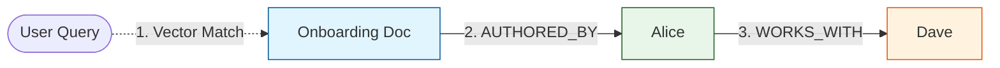
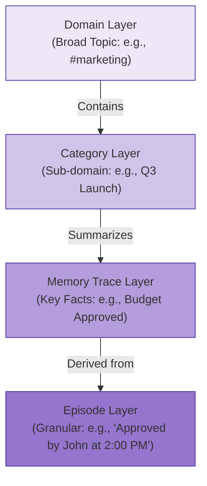
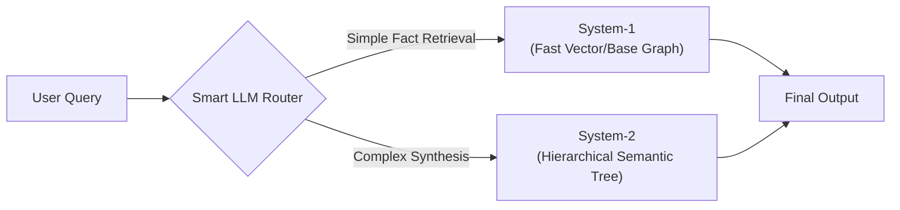
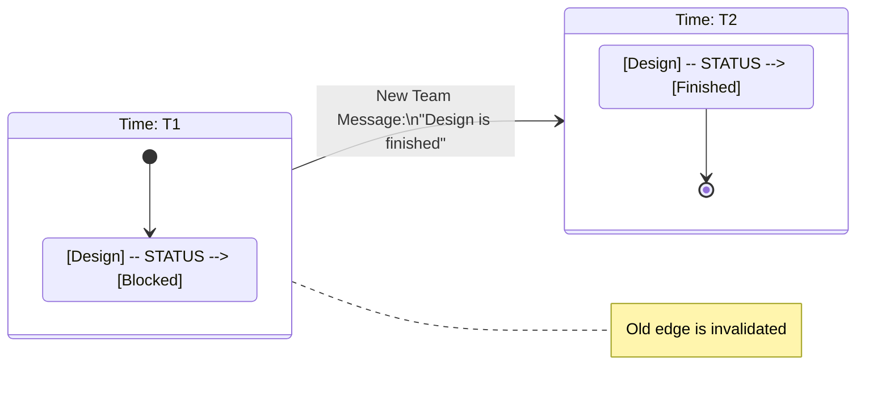
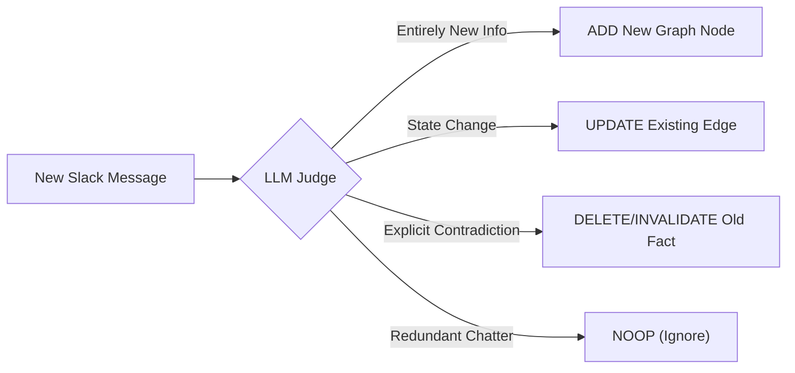

# Detailed Research Review: Memory Architectures for Conversational AI

This document outlines a detailed review of recent research and frameworks regarding advanced memory structures for AI agents. The goal is to evaluate these findings and apply them to a conversational summarization application built for business communication platforms (Slack, Discord, Teams) to assist with onboarding, project tracking, and company knowledge.

## Part 1: Detailed Paper & Framework Analysis

### 1. GraphRAG via Weaviate & Neo4j
**Source:** [weaviate.io/blog/graph-rag](https://weaviate.io/blog/graph-rag)
**Core Concept:** Hybrid Vector-Graph Search (GraphRAG).
**Detailed Findings:** Proposes a hybrid setup using Neo4j (a graph database) and Weaviate (a vector database). Weaviate's semantic search identifies relevant entities based on meaning, while Neo4j traverses a knowledge graph to find connected entities and broader contextual networks that pure vector search would miss.
**How it helps our project:** Standard vector search will fail when a user asks multi-hop questions like, "Who is working with Dave on the new onboarding doc?" Vector search understands "onboarding doc," but GraphRAG can traverse the graph from `[Onboarding Doc]` -> `(AUTHORED_BY)` -> `[Alice]` -> `(WORKS_WITH)` -> `[Dave]`. This is crucial for navigating company structures.

### 2. H-MEM (Hierarchical Memory)
**Source:** [arxiv.org/pdf/2507.22925](https://arxiv.org/pdf/2507.22925)
**Core Concept:** Top-Down Memory Organization & Temporal Decay.
**Detailed Findings:** Proposes a Four-Layer Memory Structure instead of a single pool: Domain Layer (broad topics), Category Layer (sub-domains), Memory Trace Layer (key points), and Episode Layer (granular details/timestamps). Also introduces Dynamic Memory Regulation (positive/negative feedback and simulated human forgetting curves).
**How it helps our project:** Slack channels are chaotic. By adopting this 4-layer structure, we can organize a messy #marketing channel into structured layers. If a user wants a high-level summary, we query the "Domain" or "Category" layer. If they want to know exactly what was said at 2 PM yesterday, we query the "Episode" layer. The forgetting curve helps the AI ignore old, irrelevant chatter.

### 3. System-1 vs System-2 Routing
**Source:** [arxiv.org/pdf/2602.15313](https://arxiv.org/pdf/2602.15313)
**Core Concept:** Dual-Process Graph Retrieval.
**Detailed Findings:** Defines two routes for retrieval. Route 1 (Base Graph / System-1) is a flat web for speed and precision, acting like a highly advanced "Ctrl+F" to grab specific facts. Route 2 (Hierarchical Graph / System-2) is a semantic tree built for global reasoning. It uses strict rules (Minimum Concept Abstraction, Many-to-Many Mapping, Compression Efficiency) to keep information organized without bloating.
**How it helps our project:** We can build a smart router for our chatbot. If a user asks a simple question ("What is the guest WiFi?"), we use Route 1 for a lightning-fast response. If they ask a complex question ("Summarize the roadblocks for the Q3 product launch"), we use Route 2 to navigate the semantic tree and generate a comprehensive report.

### 4. The Ebbinghaus Forgetting Curve
**Source:** [en.wikipedia.org/wiki/Forgetting_curve](https://en.wikipedia.org/wiki/Forgetting_curve)
**Core Concept:** Mathematical Memory Decay.
**Detailed Findings:** Hermann Ebbinghaus formulated the equation $R = e^{-t/S}$ to show how retention rate ($R$) decays over time ($t$) based on the strength of memory ($S$) if information is not reinforced.
**How it helps our project:** This provides the exact mathematical formula we can implement in our database scoring algorithm. Messages in Slack quickly become outdated. By applying this curve to the "relevance score" of stored messages, older messages naturally fade away unless people continue to talk about them (which reinforces their score).

### 5. MemoryBank
**Source:** [arxiv.org/pdf/2305.10250](https://arxiv.org/pdf/2305.10250)
**Core Concept:** Nightly Distillation & User Profiling.
**Detailed Findings:** Details a 3-Phase system. Phase A (Storage) records raw dialogue and uses an LLM to distill it into Daily/Global Summaries and persistent User Portraits. Phase B uses the Ebbinghaus curve for memory updates. Phase C performs a flat semantic search to inject retrieved memories into the LLM's background prompt.
**How it helps our project:** Instead of processing memories on the fly (which is expensive and slow), we can implement a nightly batch job. Every night, the system can summarize the day's Slack messages and update "User Portraits" (e.g., "John is a backend dev who prefers async communication"). This makes the AI highly personalized.

### 6. Dynamic Knowledge Graphs (Updating Memory)
**Source:** [www.ijcai.org/proceedings/2025/0002.pdf](https://www.ijcai.org/proceedings/2025/0002.pdf)
**Core Concept:** Fact Replacement & Episodic Linking.
**Detailed Findings:** Stores raw text (Episodic) and extracts Triplets (Semantic). Crucially, it links the two via "episodic edges." When the environment changes (e.g., a closed locker is now open), it detects the outdated info, deletes the old edge, and adds the new one to prevent contradictory facts. Retrieval happens via a two-step process (Semantic search to find facts, Episodic search to pull the original raw text).
**How it helps our project:** Essential for tracking project states. If someone says in Teams, "The design is blocked," and later says, "The design is finished," our system must proactively replace the "blocked" fact with "finished" so it doesn't hallucinate contradictory statuses in its summaries.

### 7. Zep Framework
**Source:** [arxiv.org/pdf/2501.13956](https://arxiv.org/pdf/2501.13956)
**Core Concept:** Bi-Temporal Tracking & Community Subgraphs.
**Detailed Findings:** Zep uses a Tri-Tiered Subgraph (Episode, Semantic Entity, and Community clusters). Its defining feature is the Bi-Temporal Model: it tracks Event Time (when it happened) and Ingestion Time (when it was recorded). Old facts aren't deleted; they are given "invalidated" timestamps. It also extracts entities using an $N$ message context window.
**How it helps our project:** The bi-temporal model is the ultimate solution for corporate changes. If a user asks, "Who was managing this project last month?", Zep's bi-temporal tracking allows our bot to look back at invalidated facts and answer correctly, providing a perfect historical audit trail of company decisions.

### 8. Mem0 / Mem0g
**Source:** [arxiv.org/pdf/2504.19413](https://arxiv.org/pdf/2504.19413)
**Core Concept:** Automated Consolidation & LLM Judges.
**Detailed Findings:** Mem0 acts as a fast vector base layer, while Mem0g is a graph-enhanced layer for multi-hop reasoning. The key innovation is Phase B: Consolidation. An LLM acts as a judge against the database, choosing to ADD, UPDATE, DELETE, or NOOP new facts against existing ones.
**How it helps our project:** This provides the exact logic for our ingestion pipeline. When a new Slack message arrives, we don't just blindly insert it. We run it through an LLM judge to compare it against the user's existing graph node, allowing the AI to organically maintain an accurate state of truth.

### 9. Graphiti (by Zep)
**Source:** [github.com/getzep/graphiti](https://github.com/getzep/graphiti)
**Core Concept:** Implementation Framework for Context Graphs.
**Detailed Findings:** An open-source Python framework that builds context graphs with temporal validity windows. It features incremental construction (no need for heavy batch jobs) and Hybrid Retrieval (Dense Semantic + BM25 Keyword + Reciprocal Rank Fusion + Graph Traversal). It handles deduplication natively.
**How it helps our project:** This is the practical implementation tool. Instead of building the graph ingestion, deduplication, and hybrid search logic from scratch, our engineering team can use Graphiti as the foundational library to connect our Slack/Teams webhooks directly to a database like Neo4j.
