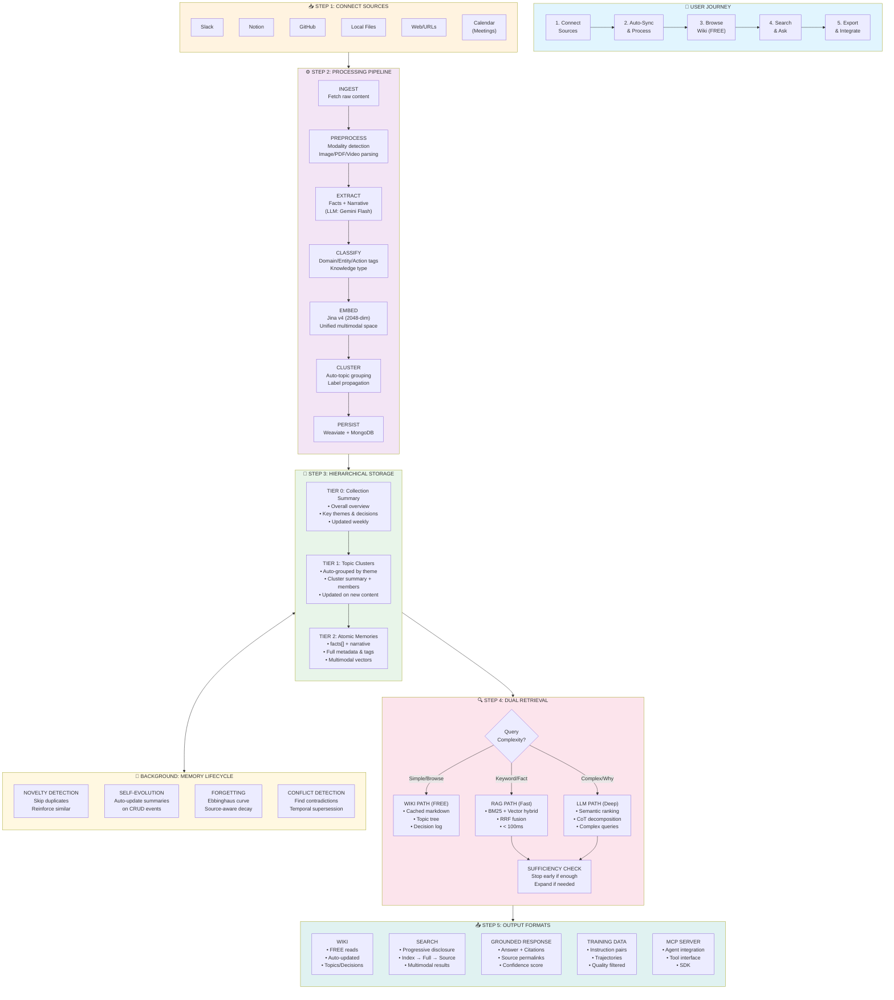
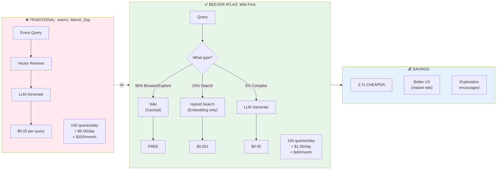
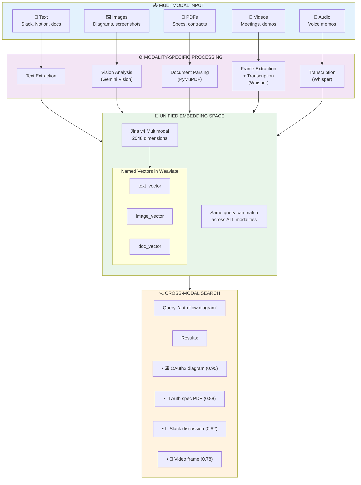
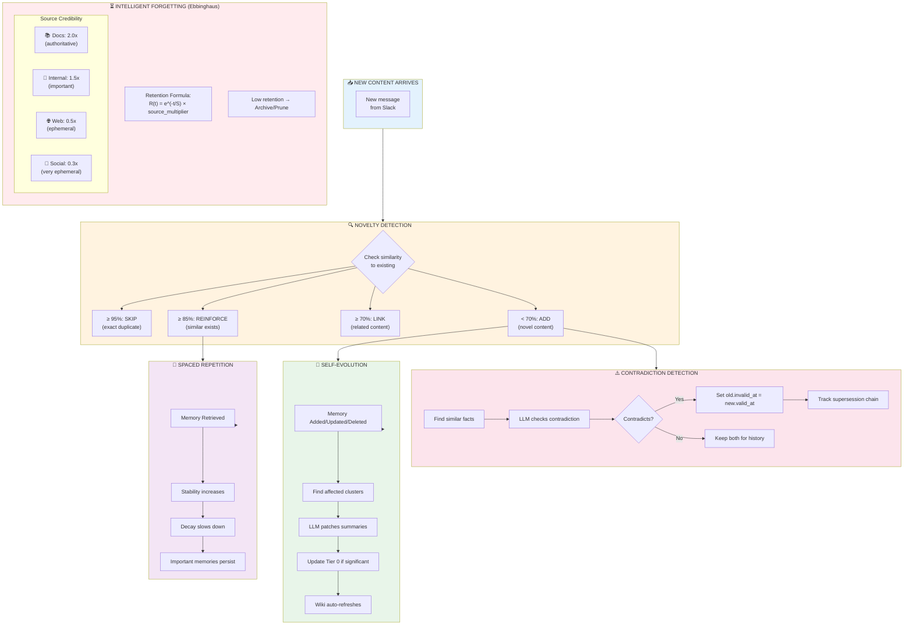
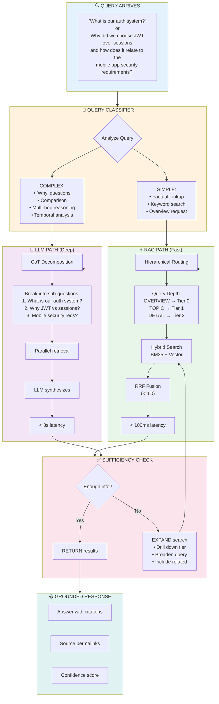
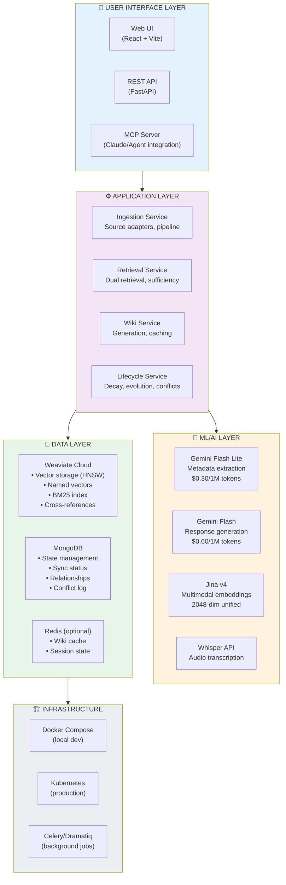
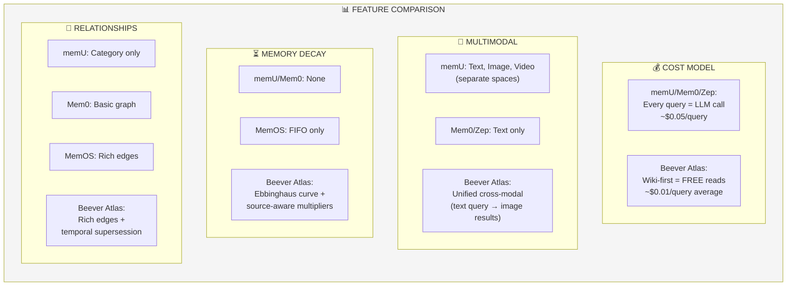
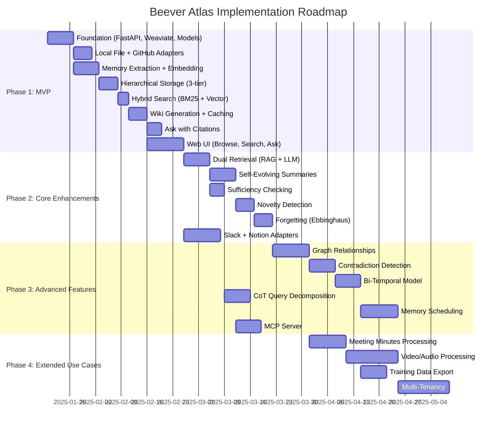

# Beever Atlas: Comprehensive Architecture Overview

> **For**: Development Team, Product Team, Stakeholders
> **Purpose**: Understand how Beever Atlas works and what makes it different from competitors

---

## TL;DR: What Makes Beever Atlas Different?

```
┌─────────────────────────────────────────────────────────────────────────────────┐
│                     BEEVER ATLAS vs COMPETITORS AT A GLANCE                      │
├─────────────────────────────────────────────────────────────────────────────────┤
│                                                                                  │
│  TRADITIONAL MEMORY SYSTEMS (memU, Mem0, Zep):                                  │
│  ┌──────────┐     ┌──────────┐     ┌──────────┐                                 │
│  │  Query   │ ──▶ │ Retrieve │ ──▶ │   LLM    │ ──▶  $0.05/query               │
│  └──────────┘     └──────────┘     └──────────┘                                 │
│       Every query hits LLM = HIGH COST, text-only, no free exploration          │
│                                                                                  │
│  ─────────────────────────────────────────────────────────────────────────────  │
│                                                                                  │
│  BEEVER ATLAS (Wiki-First + Multimodal):                                        │
│  ┌──────────┐     ┌──────────┐                                                  │
│  │  Query   │ ──▶ │   Wiki   │ ──▶  FREE (80% of queries)                      │
│  └──────────┘     └──────────┘                                                  │
│       │                                                                          │
│       │ (only if needed)                                                         │
│       ▼                                                                          │
│  ┌──────────┐     ┌──────────┐                                                  │
│  │ Retrieve │ ──▶ │   LLM    │ ──▶  $0.05 (20% of queries)                     │
│  └──────────┘     └──────────┘                                                  │
│       AVERAGE COST: $0.01/query (5x cheaper)                                    │
│       + True multimodal (text, image, video, PDF)                               │
│       + Cross-modal search ("find auth diagrams" returns images)                │
│       + Intelligent forgetting (memories decay like human brain)                │
│                                                                                  │
└─────────────────────────────────────────────────────────────────────────────────┘
```

---

## Part 1: The Complete User Journey

The following diagram shows how a user interacts with Beever Atlas from start to finish, with the underlying technical components at each step.



---

## Part 2: Why Wiki-First Architecture Matters

This is the **#1 differentiator** from competitors. Most users don't need LLM for every query.



### Wiki Content Structure

```
┌─────────────────────────────────────────────────────────────────────────┐
│  📖 WIKI: Engineering Knowledge Base                                     │
├─────────────────────────────────────────────────────────────────────────┤
│                                                                          │
│  📄 OVERVIEW (Tier 0)                                                    │
│  ├── "Our engineering team owns 12 services focused on..."              │
│  ├── Key Themes: [Auth, Payments, Data Pipeline, Infrastructure]        │
│  └── Recent: "Migrated to Kubernetes (Jan 2025)"                        │
│                                                                          │
│  📁 TOPICS (Tier 1)                                                      │
│  ├── 🔐 Authentication (23 memories)                                     │
│  │   └── "OAuth2 + JWT, migrated from sessions in Q3 2024"              │
│  ├── 💳 Payments (18 memories)                                           │
│  │   └── "Stripe integration with retry logic"                          │
│  ├── 🗄️ Database (31 memories)                                          │
│  │   └── "PostgreSQL + Redis, considering CockroachDB"                  │
│  └── 🚀 Infrastructure (15 memories)                                     │
│      └── "AWS EKS, Terraform, ArgoCD"                                   │
│                                                                          │
│  📋 DECISIONS (Extracted from Tier 2)                                    │
│  ├── 2025-01-15: "Chose Prisma over TypeORM - better DX"                │
│  ├── 2025-01-10: "Added Redis for session caching"                      │
│  └── 2025-01-05: "Delayed K8s migration by 2 weeks"                     │
│                                                                          │
│  👥 PEOPLE (Entity extraction)                                           │
│  ├── Alice: [auth, security]                                            │
│  ├── Bob: [payments, infrastructure]                                     │
│  └── Carol: [database, performance]                                      │
│                                                                          │
└─────────────────────────────────────────────────────────────────────────┘
```

---

## Part 3: True Multimodal Architecture

Unlike competitors that only support text, Beever Atlas uses **unified embedding space** for cross-modal search.



### Competitor Comparison: Multimodal Support

| Capability | memU | Mem0 | MemOS | Zep/Graphiti | **Beever Atlas** |
|------------|------|------|-------|--------------|------------------|
| Text | ✅ | ✅ | ✅ | ✅ | ✅ |
| Images | ✅ | ❌ | ❌ | ❌ | ✅ |
| PDFs | ✅ | ❌ | ✅ | ❌ | ✅ |
| Video | ✅ | ❌ | ❌ | ❌ | ✅ |
| Audio | ✅ | ❌ | ❌ | ❌ | ✅ |
| Cross-modal search | ❌ | ❌ | ❌ | ❌ | **✅** |
| Unified embeddings | ❌ | ❌ | ❌ | ❌ | **✅** |

---

## Part 4: Memory Lifecycle Management

Beever Atlas doesn't just store memories - it **evolves** them intelligently.



---

## Part 5: Dual Retrieval System

Beever Atlas uses **two retrieval modes** that automatically select based on query complexity.



---

## Part 6: Technical Stack Mapping

How each technology serves the user journey.



### Technology Decision Matrix

| Component | Choice | Why (vs alternatives) |
|-----------|--------|----------------------|
| **Vector DB** | Weaviate | Named vectors for multimodal, built-in BM25, production-ready (vs Qdrant, Pinecone) |
| **Embeddings** | Jina v4 | 2048-dim unified multimodal space (vs OpenAI 1536-dim text-only) |
| **State DB** | MongoDB | Flexible schema for relationships, async via Motor (vs PostgreSQL rigidity) |
| **LLM (cheap)** | Gemini Flash Lite | $0.30/1M tokens, fast (vs GPT-4o-mini at $0.60) |
| **LLM (quality)** | Gemini Flash | $0.60/1M tokens, good quality (vs GPT-4o at $2.50) |
| **Backend** | FastAPI | Async-first, MCP support, Python ecosystem (vs Node.js) |
| **Frontend** | React + Vite | Fast dev, component ecosystem (vs Next.js complexity for MVP) |

---

## Part 7: Competitive Feature Matrix

### Feature-by-Feature Comparison



### Summary Table

| Feature | memU | Mem0 | MemOS | Zep/Graphiti | **Beever Atlas** |
|---------|------|------|-------|--------------|------------------|
| **Wiki-First (FREE reads)** | ❌ | ❌ | ❌ | ❌ | ✅ |
| **True Cross-Modal Search** | ❌ | ❌ | ❌ | ❌ | ✅ |
| **Unified Embedding Space** | ❌ | ❌ | ❌ | ❌ | ✅ |
| **Ebbinghaus Forgetting** | ❌ | ❌ | ❌ | ❌ | ✅ |
| **Source Credibility Decay** | ❌ | ❌ | ❌ | ❌ | ✅ |
| **Bi-Temporal Model** | ❌ | ❌ | ❌ | ✅ | ✅ |
| **Contradiction Detection** | ❌ | ❌ | ✅ | ✅ | ✅ |
| **Self-Evolving Summaries** | ✅ | ❌ | Partial | ❌ | ✅ |
| **Dual Retrieval (RAG+LLM)** | ✅ | ❌ | ✅ | ✅ | ✅ |
| **CoT Query Decomposition** | ❌ | ❌ | ✅ | ❌ | ✅ |
| **Graph Relationships** | Category | Basic | Rich | Rich | Rich |
| **Training Data Export** | ❌ | ❌ | ❌ | ❌ | ✅ |

---

## Part 8: Data Flow - Complete Picture

```mermaid
flowchart TB
    subgraph Sources["📥 DATA SOURCES"]
        Slack["Slack"]
        Notion["Notion"]
        GitHub["GitHub"]
        Files["Local Files"]
        Web["Web/URLs"]
        Calendar["Calendar"]
    end

    subgraph Adapters["🔌 SOURCE ADAPTERS"]
        A1["SlackAdapter"]
        A2["NotionAdapter"]
        A3["GitHubAdapter"]
        A4["FileSystemAdapter"]
        A5["WebScraperAdapter"]
        A6["CalendarAdapter"]
    end

    subgraph Normalize["📋 NORMALIZED INPUT"]
        N1["RawContent<br/>• content: str<br/>• source_type: str<br/>• source_id: str<br/>• source_url: str<br/>• timestamp: datetime"]
    end

    subgraph Pipeline["⚙️ PROCESSING PIPELINE"]
        P1["1. PREPROCESS<br/>Detect modality<br/>Parse PDF/Image/Video"]
        P2["2. EXTRACT<br/>facts[] + narrative<br/>(Gemini Flash Lite)"]
        P3["3. CLASSIFY<br/>domain_tags<br/>entity_tags<br/>action_tags<br/>knowledge_type"]
        P4["4. EMBED<br/>Jina v4 (2048-dim)<br/>text/image/doc vectors"]
        P5["5. DEDUPE<br/>Novelty detection<br/>Skip/Reinforce/Link"]
        P6["6. CLUSTER<br/>Topic assignment<br/>Label propagation"]
        P7["7. PERSIST<br/>Weaviate + MongoDB"]
    end

    subgraph Memory["💾 ATOMIC MEMORY"]
        M1["AtomicMemory<br/>├── id<br/>├── facts: list[str]<br/>├── narrative: str<br/>├── source_*<br/>├── *_tags<br/>├── knowledge_type<br/>├── text_vector<br/>├── image_vector<br/>├── stability<br/>├── valid_at<br/>├── invalid_at<br/>├── cluster_id<br/>└── collection_id"]
    end

    subgraph Hierarchy["📚 HIERARCHICAL STORAGE"]
        H0["Tier 0: Collection Summary"]
        H1["Tier 1: Topic Clusters"]
        H2["Tier 2: Atomic Memories"]

        H0 --> H1 --> H2
    end

    subgraph Lifecycle["🔄 LIFECYCLE SERVICES"]
        L1["Self-Evolution<br/>Auto-update summaries"]
        L2["Forgetting<br/>Ebbinghaus decay"]
        L3["Conflict Detection<br/>Temporal supersession"]
    end

    subgraph Output["📤 OUTPUT INTERFACES"]
        O1["Wiki API<br/>FREE reads"]
        O2["Search API<br/>Hybrid RAG"]
        O3["Ask API<br/>Grounded responses"]
        O4["Export API<br/>Training data"]
        O5["MCP Server<br/>Agent tools"]
    end

    Sources --> Adapters
    Adapters --> Normalize
    Normalize --> Pipeline
    P1 --> P2 --> P3 --> P4 --> P5 --> P6 --> P7
    P7 --> Memory
    Memory --> Hierarchy
    Hierarchy <--> Lifecycle
    Hierarchy --> Output

    style Sources fill:#e3f2fd
    style Adapters fill:#fff3e0
    style Pipeline fill:#f3e5f5
    style Memory fill:#e8f5e9
    style Hierarchy fill:#e0f2f1
    style Lifecycle fill:#fff8e1
    style Output fill:#fce4ec
```



---

## Part 9: Key Innovations Explained

### Innovation 1: Wiki-First Pattern

```
PROBLEM: Every query costs money (LLM calls)
SOLUTION: Pre-generate browsable wiki from memories

HOW IT WORKS:
1. Tier 0/1 summaries are generated on content change
2. Wiki markdown is cached and served statically
3. 80% of user interactions are just browsing
4. Only "Ask" queries hit the LLM

RESULT: 5x cost reduction vs competitors
```

### Innovation 2: Unified Multimodal Space

```
PROBLEM: Can't search for "auth diagram" and find images
SOLUTION: Jina v4 embeds all modalities in same 2048-dim space

HOW IT WORKS:
1. Text, images, PDFs → same vector space
2. Semantic similarity works across modalities
3. Named vectors in Weaviate allow modality-specific indexes
4. Query can match any modality

RESULT: "Find deployment architecture" returns diagrams, docs, and discussions
```

### Innovation 3: Intelligent Forgetting

```
PROBLEM: Memory grows forever, old info clutters results
SOLUTION: Ebbinghaus curve + source-aware decay

HOW IT WORKS:
1. Retention = e^(-time/Stability) × source_multiplier
2. Documentation decays slowly (2.0x multiplier)
3. Social media decays fast (0.3x multiplier)
4. Frequently accessed memories gain stability
5. Low-retention memories are archived

RESULT: Fresh, relevant memories; authoritative sources persist
```

### Innovation 4: Temporal Supersession

```
PROBLEM: Facts change over time, old info misleads
SOLUTION: Bi-temporal model with contradiction detection

HOW IT WORKS:
1. Each memory has valid_at, invalid_at, created_at, expired_at
2. On new fact, find similar existing facts
3. LLM detects contradictions
4. Old fact gets invalid_at = new fact's valid_at
5. Supersession chain tracked for history

RESULT: "What was true on Jan 15?" queries work correctly
```

---

## Part 10: Implementation Phases



---

## Quick Reference: When to Use What

| User Intent | Path | Cost | Latency |
|-------------|------|------|---------|
| "Show me the overview" | Wiki → Tier 0 | FREE | ~50ms |
| "What topics do we have?" | Wiki → Tier 1 list | FREE | ~50ms |
| "Tell me about authentication" | Wiki → Tier 1 detail | FREE | ~50ms |
| "Find messages about Redis" | Search → Hybrid RAG | ~$0.001 | ~100ms |
| "What did Alice say about caching?" | Search → Hybrid RAG | ~$0.001 | ~100ms |
| "Why did we choose PostgreSQL?" | Ask → LLM Path | ~$0.02 | ~2s |
| "Compare our auth approaches over time" | Ask → CoT + LLM | ~$0.05 | ~3s |

---

## Appendix: Glossary

| Term | Definition |
|------|------------|
| **Atomic Memory** | Single unit of knowledge with facts[], narrative, and metadata |
| **Topic Cluster** | Group of related memories with summary (Tier 1) |
| **Collection Summary** | High-level overview of all knowledge (Tier 0) |
| **Wiki-First** | Pattern where reads are cached, LLM only for complex queries |
| **Dual Retrieval** | Automatic selection between RAG (fast) and LLM (deep) |
| **Sufficiency Check** | Stop retrieval early when enough context found |
| **RRF** | Reciprocal Rank Fusion - combining multiple search results |
| **Ebbinghaus Curve** | Memory decay formula: R(t) = e^(-t/S) |
| **Temporal Supersession** | When new fact invalidates old fact |
| **Cross-Modal Search** | Text query finding images/videos/docs |
| **Named Vectors** | Weaviate feature for modality-specific indexes |

---

*This document provides a comprehensive overview of Beever Atlas architecture. For implementation details, see PIVOT_PLAN.md and MVP_PLAN.md.*
