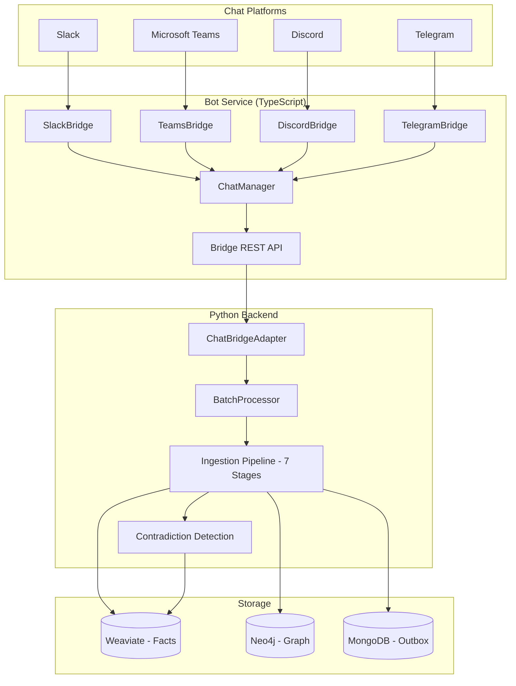
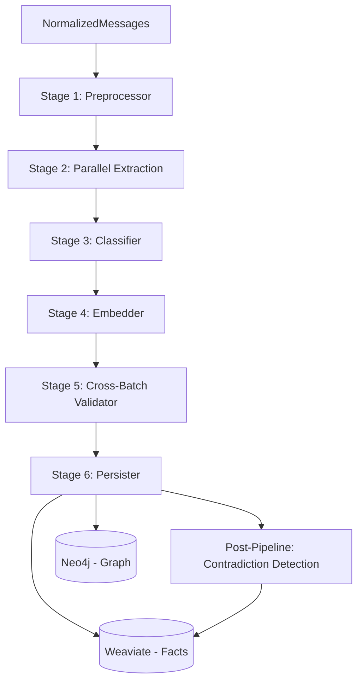

# Beever Atlas Ingestion Pipeline Architecture

## Overview

Beever Atlas is an enterprise knowledge base that ingests messages from **multiple chat platforms** and transforms them into structured knowledge stored in a dual-store system: **Weaviate** (vector store for atomic facts) and **Neo4j** (graph store for entities and relationships).

### Supported Platforms

| Platform | Adapter | Status |
|----------|---------|--------|
| **Slack** | SlackBridge | Production |
| **Microsoft Teams** | TeamsBridge | Production |
| **Discord** | DiscordBridge | Production |
| **Telegram** | TelegramBridge | Production |

Most platforms connect through a unified **Chat SDK bridge** (TypeScript bot service) that normalizes messages into a platform-agnostic `NormalizedMessage` format before they enter the Python ingestion pipeline. Telegram live updates can arrive through either backend Bot API polling or bridge webhooks; both paths persist raw updates into MongoDB first, then sync from that local source-message store.

### Telegram Ingestion Modes

Telegram has three ingestion paths:

- **Bot API polling**: Atlas calls Telegram `getUpdates` on a schedule. This is the default for local/self-hosted installs and works without a registered domain or webhook URL.
- **Webhooks**: Telegram sends HTTPS POST updates to the bot bridge when Atlas is deployed at a stable public HTTPS endpoint. The bridge forwards those updates to the backend for durable storage.
- **Desktop JSON export**: historical messages are imported from Telegram Desktop `result.json` exports.

Telegram Bot API does not fetch arbitrary historical chat history for bots. Bot ingestion starts from messages delivered after setup, and Telegram keeps pending bot updates only for a limited window. For group chats, privacy/admin settings affect which messages the bot can see. Polling and webhooks are mutually exclusive for one bot token; if a webhook is configured, `getUpdates` will not work until the webhook is removed.

## System Architecture



## Multi-Platform Architecture

### Message Normalization

All platform-specific message formats are normalized at the edge before entering the pipeline. The pipeline itself is **entirely platform-agnostic**.

**NormalizedMessage** (defined in `src/beever_atlas/adapters/base.py`):

```python
@dataclass
class NormalizedMessage:
    content: str              # Message text content
    author: str               # Platform user ID
    platform: str             # "slack" | "teams" | "discord" | "telegram"
    channel_id: str           # Platform channel identifier
    channel_name: str         # Human-readable channel name
    message_id: str           # Platform message identifier
    timestamp: datetime       # Message timestamp
    thread_id: str | None     # Thread parent ID (for replies)
    attachments: list[dict]   # Files, images, documents
    reactions: list[dict]     # Emoji reactions
    reply_count: int          # Number of thread replies
    raw_metadata: dict        # Platform-specific metadata (preserved for debugging)
    author_name: str          # Display name
    author_image: str         # Avatar URL
```

### Adapter Pattern

```
BaseAdapter (abstract)
  ├── ChatBridgeAdapter (production) — HTTP client calling bridge REST API
  └── MockAdapter (testing) — Serves JSON fixture files
```

The **ChatBridgeAdapter** communicates with the TypeScript bot service via REST. It is platform-agnostic — the bridge handles all platform-specific logic.

### Multi-Connection Support

Each platform supports **multiple connections** (e.g., 2 Slack workspaces + 3 Discord servers):

- **PlatformConnection** model stores credentials (encrypted), status, and selected channels per connection
- **Composite key routing**: `{platform}:{connectionId}` allows parallel adapter instances
- **Connection-scoped API**: `/bridge/connections/{connId}/channels` for per-connection operations

## Ingestion Pipeline Flow



The pipeline runs as a 7-stage **SequentialAgent** built on Google ADK. Each batch of messages from any platform flows through identical stages.

## Stage Details

### Stage 1: PreprocessorAgent (BaseAgent - Deterministic)

**File:** `src/beever_atlas/agents/ingestion/preprocessor.py`

**Input:** `session.state["messages"]` (NormalizedMessage dicts from any platform)
**Output:** `session.state["preprocessed_messages"]` (enriched message dicts)

**Processing steps:**
1. **Filter** — Skip bot messages, system subtypes (join/leave/topic changes), empty text
2. **Clean** — Strip platform-specific markup (Slack mrkdwn, HTML entities, mention formats)
3. **Coreference Resolution** — LLM-based pronoun/reference resolution via Gemini Flash
   - Regex pre-filter: skips LLM call when no pronouns detected (cost optimization)
   - Sliding context window: current batch + last 20 channel messages from MongoDB
   - Original text preserved in `raw_text` field
4. **Cross-Batch Thread Context** — Resolves parent messages from MongoDB when not in current batch
   - Works across all platforms that support threading (Slack, Teams, Discord)
   - Configurable: `cross_batch_thread_context_enabled` (default: true)
   - Max parent text: `thread_context_max_length` (default: 200 chars)
5. **Link Extraction** — Captures URLs, unfurl metadata, bare URLs from text
6. **Media Processing** — Registry-based extraction for attachments (see Media Extraction section)

**Output fields per message:**
```
text, raw_text, ts, user, username, platform, modality, thread_context,
preprocessed, source_link_urls, source_link_titles,
source_link_descriptions, source_media_urls, source_media_type
```

### Stage 2: Parallel Extraction (LlmAgent x2)

**Files:**
- `src/beever_atlas/agents/ingestion/fact_extractor.py`
- `src/beever_atlas/agents/ingestion/entity_extractor.py`

Runs **FactExtractor** and **EntityExtractor** in parallel via ADK `ParallelAgent`.

#### FactExtractor
**Input:** `session.state["preprocessed_messages"]`
**Output:** `session.state["extracted_facts"]`

Applies the **"6-Month Test"**: Would a new team member joining in 6 months need this fact?

**Quality scoring:** `(specificity + actionability + verifiability) / 3` — drop below 0.5.

**Output per fact:**
```
memory_text, quality_score, topic_tags, entity_tags, action_tags,
importance, source_message_id, author_id, author_name, message_ts
```

#### EntityExtractor
**Input:** `session.state["preprocessed_messages"]`
**Output:** `session.state["extracted_entities"]` (entities + relationships)

**Entity types:** Person, Technology, Project, Team, Decision, Meeting, Artifact
**Scope:** `global` (Person, Technology, Project, Team) or `channel` (Decision, Meeting, Artifact)
**Relationship types:** DECIDED, WORKS_ON, USES, OWNS, BLOCKED_BY, DEPENDS_ON, CREATED, etc.

### Stage 3: ClassifierAgent (LlmAgent)

**File:** `src/beever_atlas/agents/ingestion/classifier.py`

**Input:** `session.state["extracted_facts"]`
**Output:** `session.state["classified_facts"]`

Enriches facts with:
- **Canonical topic tags** (22-tag vocabulary): architecture, api-design, authentication, database, deployment, devops, documentation, frontend, hiring, incident, infrastructure, integration, meeting, monitoring, onboarding, performance, project-management, roadmap, security, testing, tooling, ux-design
- **Importance levels:** critical, high, medium, low

### Stage 4: EmbedderAgent (BaseAgent - Deterministic)

**File:** `src/beever_atlas/agents/ingestion/embedder.py`

**Input:** `session.state["classified_facts"]`
**Output:** `session.state["embedded_facts"]` (facts with `text_vector`)

- **Provider:** Jina Embeddings API (v4, 2048 dimensions)
- **Task type:** `text-matching`
- **Batching:** 100 facts per API call
- **Rate limiting:** Exponential backoff on HTTP 429

### Stage 5: CrossBatchValidatorAgent (LlmAgent)

**File:** `src/beever_atlas/agents/ingestion/cross_batch_validator.py`

**Input:** `session.state["embedded_facts"]`, `session.state["extracted_entities"]`, `session.state["known_entities"]`, `session.state["embedding_similarity_candidates"]`
**Output:** `session.state["validated_entities"]`

**4-Step validation:**
1. **Alias Resolution** — Match against known entities using string matching + embedding similarity candidates
2. **Soft Orphan Handling** — Entities with zero relationships get `status: "pending"` (NOT deleted)
3. **Relationship Consistency** — Resolve contradictions (prefer higher confidence)
4. **Reference Rewrite** — Update all relationship source/target to canonical names

**Embedding similarity pre-processing** (in `batch_processor.py`):
- Before pipeline runs, compute Jina embeddings for extracted entity names
- Run cosine similarity against known entity `name_vector` embeddings
- Inject candidates into session state for the LLM validator to consider
- Graceful degradation: if Jina/Neo4j unavailable, falls back to string matching only

### Stage 6: PersisterAgent (BaseAgent - Deterministic)

**File:** `src/beever_atlas/agents/ingestion/persister.py`

**Input:** `session.state["embedded_facts"]`, `session.state["validated_entities"]`, `session.state["preprocessed_messages"]`
**Output:** `session.state["persist_result"]`

**Outbox pattern:**
1. Create WriteIntent in MongoDB (durability journal)
2. Batch compute `name_vector` for entities (single Jina API call)
3. Batch upsert facts to Weaviate (deterministic UUIDs for idempotent retries)
4. Batch upsert entities to Neo4j (with `status`, `pending_since`, `name_vector`)
5. Batch upsert relationships to Neo4j
6. Store `name_vector` embeddings on Neo4j entity nodes
7. Promote pending entities that gained relationships in this batch
8. Create episodic links (Entity → Event → Fact)
9. Create Media nodes + REFERENCES_MEDIA edges
10. Mark WriteIntent complete

### Post-Pipeline: Contradiction Detection

**File:** `src/beever_atlas/services/contradiction_detector.py`
**Called from:** `src/beever_atlas/services/batch_processor.py` (after pipeline completes)

Runs **outside** the persister's outbox transaction to preserve BaseAgent deterministic contract.

For each new fact:
1. Query Weaviate for existing facts with overlapping entity/topic tags
2. LLM compares new fact vs candidates for contradictions
3. **High confidence (>= 0.8):** Auto-supersede — set `invalid_at` on old fact, `supersedes`/`superseded_by` links
4. **Medium confidence (0.5-0.8):** Flag `potential_contradiction` (no auto-supersession)
5. **Low confidence (< 0.5):** No action

## Data Models

### AtomicFact (Weaviate)

```
id, memory_text, quality_score, tier, cluster_id,
channel_id, platform,                              ← platform-agnostic scoping
author_id, author_name, message_ts, thread_ts, source_message_id,
topic_tags[], entity_tags[], action_tags[], importance,
graph_entity_ids[], source_media_url, source_media_type,
source_media_urls[], source_link_urls[], source_link_titles[],
source_link_descriptions[], valid_at, invalid_at,
superseded_by, supersedes, potential_contradiction,
text_vector (2048-dim Jina embedding)
```

The `platform` field tracks which platform the fact originated from (slack, teams, discord, telegram). The `channel_id` is the platform's native channel identifier.

### GraphEntity (Neo4j)

```
name, type, scope, channel_id, properties (JSON), aliases[],
status ("active" | "pending"), pending_since, name_vector[],
source_message_id, message_ts, created_at, updated_at
```

Entities with `scope: "global"` (Person, Technology, Project, Team) are shared across all channels and platforms. Entities with `scope: "channel"` (Decision, Meeting, Artifact) are scoped to their originating channel.

### GraphRelationship (Neo4j)

```
type, source, target, confidence, valid_from, valid_until,
context, source_message_id, source_fact_id, created_at
```

## Walkthrough Example

This example traces a batch of 3 Slack messages through the entire pipeline to show what happens at each stage.

### Input: Raw Messages

A sync job fetches these 3 messages from `#engineering` in a Slack workspace:

```
Message 1 (ts: 1711900000.001):
  Author: Alice Chen
  Text: "We decided to migrate from MySQL to PostgreSQL for the Atlas project.
         Here's the migration plan."
  Attachment: migration-plan.docx (45 kB)

Message 2 (ts: 1711900060.002):
  Author: Bob Kim
  Text: "Sounds great, I'll start working on it next sprint."
  Thread parent: 1711900000.001

Message 3 (ts: 1711900120.003):
  Author: Carol Wu
  Text: "FYI — we deprecated Redis last month, switching to Memcached."
```

### Stage 1: Preprocessor

**Filtering:** All 3 messages pass (not bots, not system messages, have content).

**Text cleaning:** Slack markup stripped (none in this example).

**Coreference resolution:** Message 2 contains "it" — the resolver rewrites:
```
Before: "Sounds great, I'll start working on it next sprint."
After:  "Sounds great, I'll start working on the MySQL to PostgreSQL migration next sprint."
raw_text preserved: "Sounds great, I'll start working on it next sprint."
```

**Thread context:** Message 2 is a reply to Message 1. Since both are in the same batch:
```
thread_context: "[Reply to Alice Chen: We decided to migrate from MySQL to PostgreSQL for the Atlas project...]"
```

**Media processing:** The `.docx` attachment on Message 1 is processed by `OfficeExtractor`:
```
[Attachment: migration-plan.docx (DOCX, 45 kB)]
[Document text: ## Migration Plan
Phase 1: Schema conversion (2 weeks)
Phase 2: Data migration with dual-write (1 week)
Phase 3: Cutover and validation (3 days)
...]
```
This extracted text is appended to Message 1's `text` field.

**Output:** 3 enriched messages with `modality`, `thread_context`, `source_media_urls`, etc.

### Stage 2: Parallel Extraction

**FactExtractor** produces 4 facts:

| # | memory_text | quality | importance | entity_tags |
|---|------------|---------|------------|-------------|
| 1 | "Team decided to migrate from MySQL to PostgreSQL for the Atlas project" | 0.92 | high | [Alice Chen, MySQL, PostgreSQL, Atlas] |
| 2 | "Atlas migration plan: Phase 1 schema conversion (2 weeks), Phase 2 dual-write (1 week), Phase 3 cutover (3 days)" | 0.85 | high | [Atlas, MySQL, PostgreSQL] |
| 3 | "Bob Kim will start the MySQL to PostgreSQL migration next sprint" | 0.68 | medium | [Bob Kim, MySQL, PostgreSQL] |
| 4 | "Team deprecated Redis and switched to Memcached" | 0.87 | high | [Redis, Memcached] |

**EntityExtractor** produces:

Entities:
| name | type | scope |
|------|------|-------|
| Alice Chen | Person | global |
| Bob Kim | Person | global |
| Carol Wu | Person | global |
| MySQL | Technology | global |
| PostgreSQL | Technology | global |
| Atlas | Project | global |
| Redis | Technology | global |
| Memcached | Technology | global |
| MySQL to PostgreSQL migration | Decision | channel |

Relationships:
| source | type | target | confidence |
|--------|------|--------|------------|
| Alice Chen | DECIDED | MySQL to PostgreSQL migration | 0.95 |
| Bob Kim | WORKS_ON | MySQL to PostgreSQL migration | 0.85 |
| Atlas | DEPENDS_ON | PostgreSQL | 0.90 |
| Atlas | USES | MySQL | 0.80 |
| Carol Wu | DECIDED | Redis deprecation | 0.90 |

### Stage 3: Classifier

Facts are enriched with canonical topic tags:

| Fact | topic_tags | importance |
|------|-----------|------------|
| "Team decided to migrate..." | [database, architecture] | high |
| "Atlas migration plan..." | [database, project-management] | high |
| "Bob Kim will start..." | [database] | medium |
| "Team deprecated Redis..." | [infrastructure, architecture] | high |

### Stage 4: Embedder

Each fact gets a 2048-dimensional Jina embedding vector stored in `text_vector`. Single API call for all 4 facts.

### Stage 5: Cross-Batch Validator

**Known entities** from prior batches include: `{"name": "Beever Atlas", "aliases": ["Atlas"], "type": "Project"}`.

**Embedding similarity pre-processing** (in batch_processor): The name "Atlas" is compared against known entity embeddings. "Beever Atlas" scores 0.93 similarity — injected as a merge candidate.

**Alias Resolution:** The LLM sees the merge candidate and merges `Atlas` → `Beever Atlas` (canonical).

**Orphan handling:** All entities have relationships, so all get `status: "active"`. If `Carol Wu` had no relationships, she'd get `status: "pending"` instead of being deleted.

**Reference rewrite:** All relationships referencing "Atlas" are updated to "Beever Atlas".

**Output:**
```json
{
  "merges": [{"canonical": "Beever Atlas", "merged_from": ["Atlas"]}],
  "entities": [... all entities with status: "active" ...],
  "relationships": [... all with "Beever Atlas" instead of "Atlas" ...]
}
```

### Stage 6: Persister

1. **WriteIntent** created in MongoDB (outbox journal)
2. **name_vector** computed for all 9 entities in a single Jina API call
3. **Weaviate:** 4 facts upserted with deterministic UUIDs
4. **Neo4j:** 9 entities upserted (with `name_vector`, `status: "active"`)
5. **Neo4j:** 5 relationships upserted
6. **name_vectors** stored on Neo4j entity nodes
7. **Episodic links:** Each fact's entity_tags → Event → Fact chain created
8. **Media node:** `migration-plan.docx` URL → Media node + REFERENCES_MEDIA edges
9. **WriteIntent** marked complete

### Post-Pipeline: Contradiction Detection

After persistence, the contradiction detector runs on the 4 new facts:

- **Fact 4** ("Team deprecated Redis and switched to Memcached") is checked against existing facts.
- Weaviate query finds an existing fact: "Team uses Redis for session caching" (from 3 months ago).
- LLM comparison returns: `{"confidence": 0.92, "reason": "Redis deprecated, replaced by Memcached"}`
- Since 0.92 >= 0.8 threshold: **auto-supersede**
  - Old fact gets `invalid_at = now`, `superseded_by = <new_fact_id>`
  - New fact gets `supersedes = <old_fact_id>`
- Future queries will only return the Memcached fact (unless `include_superseded=True`).

### Final State After This Batch

**Weaviate:**
- 4 new facts stored (with embeddings)
- 1 old fact marked as superseded (`invalid_at` set)

**Neo4j:**
- 9 entities (8 active, 0 pending) — "Atlas" merged into "Beever Atlas"
- 5 new relationships
- 4 Event nodes (episodic links)
- 1 Media node (migration-plan.docx)

**Search:** A user querying "what database are we using?" via `POST /api/search` would get Fact 1 ("decided to migrate to PostgreSQL") ranked highest by hybrid search, while the superseded "uses Redis" fact would be excluded.

## Entity Lifecycle

```
                    +-----------+
                    |  Extracted |
                    +-----+-----+
                          |
               has relationships?
                    /          \
                  yes           no
                  /               \
          +------+------+   +-----+------+
          |   active    |   |   pending  |
          +------+------+   +-----+------+
                 |                 |
                 |         gains relationship?
                 |            /        \
                 |          yes         no (after grace period)
                 |          /             \
                 |   +-----+------+   +---+---+
                 |   |  promoted  |   | pruned |
                 |   |  (active)  |   +-------+
                 |   +------------+
                 |
          fact contradicted?
            /        \
          yes         no
          /             \
   +-----+------+   (unchanged)
   | superseded |
   | invalid_at |
   +------------+
```

**Grace period:** Configurable via `orphan_grace_period_days` (default: 7 days). Background reconciler prunes expired pending entities.

## Search & Retrieval

### API Endpoints

| Endpoint | Method | Description |
|----------|--------|-------------|
| `POST /api/search` | Global | Semantic/hybrid fact search across all channels and platforms |
| `GET /api/channels/{id}/memories` | Scoped | List facts for a specific channel with field filters |
| `GET /api/graph/entities` | Global | List entities with optional channel/type filter |

### Weaviate Search Modes

| Mode | Method | Description |
|------|--------|-------------|
| `exact` | `list_facts()` | Field-filter only (channel, topic, entity, importance, date) |
| `semantic` | `semantic_search()` | Near-vector cosine similarity using Jina embeddings |
| `hybrid` | `hybrid_search()` | Merges vector + field-filter results, deduplicates, boosts overlaps |

**Default:** `hybrid` via `POST /api/search`

**Superseded facts:** Excluded by default (`invalid_at IS NULL` filter). Use `include_superseded=True` for historical access.

## Media Extraction Registry

```
MediaExtractorRegistry
  ├── PdfExtractor       → .pdf (pypdf text extraction)
  ├── ImageExtractor     → .png/.jpg/.gif/.webp (Gemini Flash vision)
  ├── OfficeExtractor    → .docx/.xlsx/.pptx (python-docx/openpyxl/python-pptx)
  ├── VideoExtractor     → .mp4/.mov/.webm (Gemini Flash transcription)
  ├── AudioExtractor     → .mp3/.wav/.m4a/.ogg (Gemini Flash transcription)
  └── (fallback)         → metadata only [Attachment: name (type)]
```

All extractors use **Gemini Flash** for AI-powered content understanding (vision for images, transcription for audio/video). No external API keys required beyond `google_api_key`.

All extractors return `MediaContent(text, media_urls, media_type, metadata)`. The preprocessor appends extracted text to the message `text` field for downstream fact/entity extraction. This works identically regardless of which platform the attachment originated from.

## Configuration

### Pipeline Settings (`src/beever_atlas/infra/config.py`)

| Setting | Default | Description |
|---------|---------|-------------|
| `coref_enabled` | `True` | Enable coreference resolution |
| `coref_history_limit` | `20` | Channel history messages for context |
| `coref_model` | `gemini-2.5-flash` | LLM for coreference |
| `entity_similarity_threshold` | `0.85` | Cosine similarity for entity merge candidates |
| `merge_rejection_ttl_days` | `30` | How long rejected merges are cached |
| `media_office_max_chars` | `10000` | Max chars for Office doc extraction |
| `media_video_max_duration_minutes` | `10` | Max video duration |
| `media_video_max_size_mb` | `100` | Max video file size |
| `media_audio_max_duration_minutes` | `30` | Max audio duration |
| `semantic_search_min_similarity` | `0.7` | Minimum similarity for search results |
| `contradiction_confidence_threshold` | `0.8` | Auto-supersede threshold |
| `contradiction_flag_threshold` | `0.5` | Flag potential contradiction threshold |
| `cross_batch_thread_context_enabled` | `True` | Enable cross-batch thread lookup |
| `thread_context_max_length` | `200` | Max chars for parent message text |
| `orphan_grace_period_days` | `7` | Days before pending entities are pruned |

## Durability & Error Handling

- **Outbox pattern:** WriteIntent in MongoDB ensures facts/entities are never partially written
- **WriteReconciler:** Background task retries incomplete intents
- **Non-fatal integrations:** Coreference resolution, embedding computation, contradiction detection — all wrapped in try/except, pipeline continues on failure
- **Deterministic IDs:** `AtomicFact.deterministic_id()` generates UUID5 for idempotent upserts
- **Retry with backoff:** LLM ServerError (503) retries up to 3 times with 10/30/60s backoff

## Testing & Verification

### 1. Unit Tests (no services needed)

```bash
# Feature verification — 67 checks covering all 7 hardening features
python scripts/dry_run_pipeline_hardening.py

# Pytest suite — 28 tests with mocked stores
python -m pytest tests/test_pipeline_hardening.py -v
```

### 2. Mock Ingestion Test (requires Google API key only)

Tests the full pipeline with 8 synthetic messages across Slack/Teams/Discord:

```bash
# Preprocessor only (no LLM, no API keys needed):
python scripts/test_ingestion_mock.py --preprocess-only

# Full pipeline (requires GOOGLE_API_KEY + JINA_API_KEY in .env):
python scripts/test_ingestion_mock.py

# Verbose output with full JSON:
python scripts/test_ingestion_mock.py --verbose
```

The mock test exercises: bot filtering, coreference resolution, thread context,
link extraction, multi-platform handling, fact extraction, entity extraction,
and entity deduplication hints.

### 3. Real Channel Dry Run (requires bridge + platform connection)

Test against actual channel messages without writing to databases:

```bash
# Fetch from live channel and run extraction (results cached):
python -m beever_atlas.scripts.dry_run <CHANNEL_ID>

# Re-run with cached messages (instant, no bridge fetch):
python -m beever_atlas.scripts.dry_run <CHANNEL_ID> --cached

# Limit to N messages:
python -m beever_atlas.scripts.dry_run <CHANNEL_ID> --limit 10
```

### 4. Real Environment Verification

After deploying to a real environment with all services running (Weaviate, Neo4j, MongoDB, bridge):

#### Step A: Trigger a full sync

```bash
# Via API — trigger sync for a specific channel:
curl -X POST http://localhost:8000/api/channels/<CHANNEL_ID>/sync
```

Or use the web UI: navigate to a channel → click "Sync".

#### Step B: Verify facts in Weaviate

```bash
# Count facts for a channel:
curl http://localhost:8000/api/channels/<CHANNEL_ID>/memories?limit=5

# Check supersession fields (should see superseded_by/supersedes on contradicted facts):
curl http://localhost:8000/api/channels/<CHANNEL_ID>/memories | python -m json.tool | grep -A5 "superseded"
```

#### Step C: Verify entities in Neo4j

Open Neo4j Browser (http://localhost:7474) and run:

```cypher
-- Check entity statuses (active vs pending):
MATCH (e:Entity) RETURN e.name, e.status, e.pending_since LIMIT 20

-- Check for merged entities (aliases populated):
MATCH (e:Entity) WHERE size(e.aliases) > 0
RETURN e.name, e.aliases, e.type LIMIT 10

-- Check name_vector populated:
MATCH (e:Entity) WHERE e.name_vector IS NOT NULL
RETURN e.name, size(e.name_vector) AS vector_dims LIMIT 10

-- Check entity dedup (should NOT have "Atlas" and "Beever Atlas" as separate nodes):
MATCH (e:Entity) WHERE e.name CONTAINS 'Atlas'
RETURN e.name, e.type, e.aliases

-- Check episodic links (Entity → Event → Fact chain):
MATCH (e:Entity)-[:MENTIONED_IN]->(ev:Event)
RETURN e.name, ev.weaviate_id, ev.channel_id LIMIT 10
```

#### Step D: Verify semantic search

```bash
# Test hybrid search via API:
curl -X POST http://localhost:8000/api/search \
  -H "Content-Type: application/json" \
  -d '{"query": "what database are we using", "limit": 5}'
```

Expected: Returns facts ranked by semantic similarity, with `similarity_score` per result.

#### Step E: Verify contradiction detection

After syncing a channel where someone says "we deprecated X" about something previously mentioned as "we use X":

```cypher
-- In Neo4j Browser, check for superseded facts:
MATCH (e:Entity)-[:MENTIONED_IN]->(ev:Event)
WHERE ev.weaviate_id IS NOT NULL
RETURN e.name, ev.weaviate_id
```

```bash
# Check Weaviate for invalidated facts:
curl "http://localhost:8000/api/channels/<CHANNEL_ID>/memories" | \
  python -c "import sys,json; [print(f['memory_text'],'→ superseded_by:',f.get('superseded_by','none')) for f in json.load(sys.stdin).get('memories',[])]"
```

#### Step F: Verify pending entity promotion

1. Sync a batch where someone first mentions "Project X" with no relationships → entity should be `status: "pending"`
2. Sync a later batch where someone says "Bob works on Project X" → entity should be promoted to `status: "active"`

```cypher
-- Check pending entities:
MATCH (e:Entity) WHERE e.status = 'pending'
RETURN e.name, e.pending_since

-- After second sync, verify promotion:
MATCH (e:Entity {name: 'Project X'})
RETURN e.name, e.status, e.pending_since
```

### 5. Performance Benchmarking

Monitor these metrics during real syncs:

| Metric | Where to Check | Healthy Range |
|--------|----------------|---------------|
| Batch processing time | Logs: `BatchProcessor: done` | < 60s per batch of 10 messages |
| Preprocessor time | Logs: `PreprocessorAgent: done` | < 5s (< 15s with media) |
| Fact extraction time | Dry run output | < 10s per batch |
| Entity extraction time | Dry run output | < 10s per batch |
| Embedding time | Logs: `EmbedderAgent` | < 3s per batch |
| Weaviate upsert | Logs: `PersisterAgent: weaviate upsert` | < 2s per batch |
| Neo4j upsert | Logs: `PersisterAgent: neo4j entity upsert` | < 2s per batch |
| Contradiction detection | Logs: `ContradictionDetector` | < 5s per batch (post-pipeline) |

```bash
# Watch pipeline logs in real-time during a sync:
tail -f logs/beever_atlas.log | grep -E "(BatchProcessor|PreprocessorAgent|PersisterAgent|ContradictionDetector)"
```
