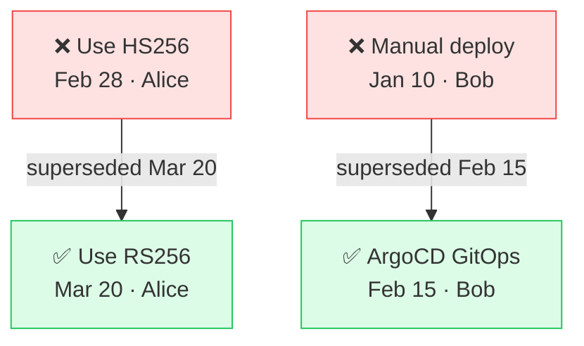
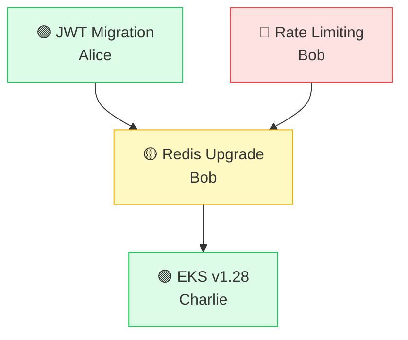

# Wiki Generation

The wiki combines both memory systems to produce a comprehensive, **pageable, hierarchical knowledge base** for each channel — similar to how DeepWiki generates multi-page documentation for repositories. Each channel wiki consists of **fixed structural pages** (always present) and **agent-generated topic pages** (dynamically created based on channel content). Large channels naturally get deeper wikis with more pages and sub-sections.

> **Status**: Implemented. The WikiCompiler, WikiBuilder, and WikiCache are all operational. Sub-topic depth (3+ levels) and some fixed pages (Glossary, Tech Stack, Projects) are planned for a future phase.
Every wiki page supports rich content: Mermaid diagrams, charts, tables, lists, callout boxes, inline citations with original message permalinks, entity chips, and embedded media references.

Design informed by research across 14+ platforms: DeepWiki, Notion, Confluence, Guru, Tettra, Slite, Glean, Dashworks, Devin Wiki, Mem.ai, Sana AI, Microsoft Copilot Pages, Google NotebookLM, Dust.tt, and Slack AI.

---

## Architecture: Fixed Pages + Agent-Generated Pages

The wiki has two kinds of pages:

| Kind | Pages | How they're built |
|------|-------|-------------------|
| **Fixed** | Overview, People, Decisions, Recent Activity, FAQ, Glossary, Resources & Media | Template-driven — `wiki_builder.py` fills structured templates from Weaviate + Neo4j data |
| **Agent-generated** | Topic pages (e.g., "Authentication", "Infrastructure") and their sub-pages | `consolidation_agent` (ADK) analyzes Tier 1 clusters and generates page structure, deciding how to split large topics into sub-pages |

This hybrid approach means:
- Small channels (50 messages, 2 topics) get a compact wiki: Overview + 2 topic pages + People + Decisions
- Large channels (10,000 messages, 20 topics) get a deep wiki: Overview + 20 topic pages (some with sub-pages) + People + Decisions + Tech Stack + Projects + full Glossary + rich FAQ

The agent decides the depth — not the template.

---

## Wiki Structure & Navigation

### Sidebar Navigation (DeepWiki-style)

Every channel wiki has a persistent left sidebar showing the page hierarchy:

```
#backend-engineering Wiki
─────────────────────────

1. Overview                    ← fixed
2. Topics                      ← section header
   2.1 Authentication          ← agent-generated
     2.1.1 JWT Migration       ← agent-generated sub-page
     2.1.2 OAuth Integration   ← agent-generated sub-page
   2.2 Infrastructure          ← agent-generated
     2.2.1 AWS EKS Setup       ← agent-generated sub-page
     2.2.2 Terraform Modules   ← agent-generated sub-page
   2.3 CI/CD Pipeline          ← agent-generated
   2.4 API Design              ← agent-generated
3. People & Experts            ← fixed
4. Decisions                   ← fixed
5. Tech Stack                  ← fixed
6. Projects                    ← fixed
7. Recent Activity             ← fixed
8. FAQ                         ← fixed
9. Glossary                    ← fixed
10. Resources & Media          ← fixed
```

- Numbered hierarchy like DeepWiki
- Current page highlighted in sidebar
- Collapsible sections (topics collapse/expand)
- Page count badge next to "Topics" showing total topic pages
- Desktop: persistent 220px sidebar. Mobile: slide-out drawer

### URL Structure

```
/channels/:id/wiki                     → Overview (default landing)
/channels/:id/wiki/people              → People & Experts
/channels/:id/wiki/decisions           → Decisions
/channels/:id/wiki/tech-stack          → Tech Stack
/channels/:id/wiki/projects            → Projects
/channels/:id/wiki/activity            → Recent Activity
/channels/:id/wiki/faq                 → FAQ
/channels/:id/wiki/glossary            → Glossary
/channels/:id/wiki/resources           → Resources & Media
/channels/:id/wiki/topics/:slug        → Topic page (e.g., /topics/authentication)
/channels/:id/wiki/topics/:slug/:sub   → Sub-page (e.g., /topics/authentication/jwt-migration)
```

---

## Fixed Pages — Detailed Spec

### Page 1: Overview (landing page)

The entry point for the channel wiki. Provides a high-level summary and navigation into deeper content.

```
┌──────────────────────────────────────────────────────────────────┐
│  Wiki Sidebar (220px)  │  #backend-engineering                   │
│                        │  Overview                               │
│  1. Overview ←         │─────────────────────────────────────────│
│  2. Topics (8)         │                                         │
│     2.1 Authentication │  Slack · 42 members · 3,241 messages    │
│     2.2 Infrastructure │  Last synced: 2h ago · Wiki: Fresh ●    │
│     2.3 CI/CD          │                                         │
│     2.4 API Design     │  The backend engineering channel is     │
│     ...                │  the primary hub for API design,        │
│  3. People             │  infrastructure decisions, and          │
│  4. Decisions          │  deployment workflows...                │
│  5. Tech Stack         │                                         │
│  6. Projects           │  [donut chart: topic distribution]      │
│  7. Activity           │                                         │
│  8. FAQ                │  ─────────────────────────────────────  │
│  9. Glossary           │  Key Highlights                         │
│  10. Resources         │  • 8 active decisions                   │
│                        │  • 12 team members identified           │
│                        │  • 5 active projects                    │
│                        │  • 23 documents & links shared          │
│                        │                                         │
│                        │  ─────────────────────────────────────  │
│                        │  Topic Overview                         │
│                        │                                         │
│                        │  [mermaid: topic relationship graph]    │
│                        │                                         │
│                        │  ┌──────────┐ ┌──────────┐ ┌────────┐ │
│                        │  │Auth (23) │ │Infra (15)│ │CI/CD(8)│ │
│                        │  │JWT, OAuth│ │EKS, TF   │ │GHA     │ │
│                        │  │→ Read    │ │→ Read    │ │→ Read  │ │
│                        │  └──────────┘ └──────────┘ └────────┘ │
│                        │                                         │
│                        │  ─────────────────────────────────────  │
│                        │  Recent Changes (last 7 days)           │
│                        │  • +8 facts, +1 decision, +2 entities  │
│                        │  → View full activity                   │
└──────────────────────────────────────────────────────────────────┘
```

**Content:**
- Channel name, platform icon, one-line description
- Metadata row: member count, messages ingested, last synced, wiki freshness badge
- 2-3 paragraph auto-generated summary (Tier 0)
- **Donut chart**: Topic distribution by memory count
- **Key highlights**: Counts of decisions, people, projects, resources
- **Topic overview**: Mermaid graph of topic relationships + topic cards linking to topic pages
- **Recent changes summary**: Brief diff linking to Activity page

**Source**: Weaviate Tier 0 (FREE) + MongoDB channel metadata + Neo4j counts

---

### Page 3: People & Experts

```
┌─────────────────────────────────────────────────────────────────┐
│  Sidebar  │  People & Experts                                   │
│           │─────────────────────────────────────────────────────│
│           │  [bar chart: messages per week by person]            │
│           │                                                      │
│           │  Decision Makers                                     │
│           │  ┌────────────────────────────────────────────────┐ │
│           │  │ Alice · Auth Lead                               │ │
│           │  │ Expertise: Auth  API  OAuth                     │ │
│           │  │ Decisions: JWT migration [1], Rate limiting [4] │ │
│           │  │ Active 2 days ago                                │ │
│           │  └────────────────────────────────────────────────┘ │
│           │                                                      │
│           │  Active Contributors                                 │
│           │  ┌────────────────────────────────────────────────┐ │
│           │  │ Bob · 12 msgs/week                              │ │
│           │  │ Topics: Infra  CI/CD  Terraform                 │ │
│           │  │ Active today                                     │ │
│           │  └────────────────────────────────────────────────┘ │
│           │                                                      │
│           │  Subject Experts (3+ topics)                         │
│           │  ...                                                 │
│           │                                                      │
│           │  ─────────────────────────────────────────────────  │
│           │  Sources                                             │
│           │  [1] @alice · Mar 20 · View ↗                       │
└─────────────────────────────────────────────────────────────────┘
```

**Content:**
- **Bar chart**: Messages per week by contributor (last 30 days)
- Grouped by role (auto-detected from Neo4j edges):
  - **Decision Makers** — people with `DECIDED` edges
  - **Active Contributors** — people with high `MENTIONED_IN` frequency
  - **Subject Experts** — people linked to 3+ topics
- Each person card: name, role, expertise topic chips (link to topic pages), key decisions, last active
- Bottom citations section

**Source**: Neo4j `Person → MENTIONED_IN, DECIDED, WORKS_ON` edges

---

### Page 4: Decisions

**Content:**
- **Mermaid flowchart**: Supersede chains (green = active, red = superseded)



- Filter toggles: Active only | All | By person
- Vertical timeline (newest first), each entry:
  - Date, decision title, who decided, status badge (**Active** / **Superseded** / **Pending**)
  - What it superseded (strikethrough)
  - Affected topics (link to topic pages) and technologies as chips
  - Source citation link
- Bottom citations section

**Source**: Neo4j `Decision` nodes + `SUPERSEDES` edges

---

### Page 5: Tech Stack

**Content:**
- Table/grid of Technology nodes scoped to this channel
- Each entry: technology name, category (language/framework/service/tool), who champions it, related decisions, first mentioned, related topic page link
- Example: `JWT (RS256) — Auth · Championed by Alice · Decided Mar 20 [1] · See: Authentication`

**Source**: Neo4j `Technology` nodes + relationships

---

### Page 6: Projects

**Content:**
- **Mermaid graph**: Project dependency graph (green = active, yellow = in progress, red = blocked)



- Cards per project: name, lead, status (Active/Completed/Blocked), BLOCKED_BY chips, related decisions/people/technologies, link to related topic pages

**Source**: Neo4j `Project` nodes + `BLOCKED_BY, WORKS_ON, USES` edges

---

### Page 7: Recent Activity

**Content:**
- **Area chart**: 7-day knowledge growth trend (facts/decisions/entities stacked)

```chart
{
  "type": "area",
  "title": "Knowledge growth (last 7 days)",
  "data": [
    { "date": "Apr 01", "facts": 5, "decisions": 1, "entities": 0 },
    { "date": "Apr 02", "facts": 2, "decisions": 0, "entities": 2 },
    { "date": "Apr 03", "facts": 8, "decisions": 0, "entities": 1 },
    { "date": "Apr 04", "facts": 4, "decisions": 1, "entities": 0 },
    { "date": "Apr 05", "facts": 2, "decisions": 0, "entities": 0 },
    { "date": "Apr 06", "facts": 6, "decisions": 1, "entities": 2 },
    { "date": "Apr 07", "facts": 3, "decisions": 0, "entities": 1 }
  ],
  "xKey": "date",
  "series": ["facts", "decisions", "entities"],
  "colors": ["#6366f1", "#f59e0b", "#22c55e"]
}
```

- "What changed since last refresh" diff callout at top
- Grouped by day: new facts (count + highlights), new decisions, new entities, contradictions resolved
- Each item links to its topic page

**Source**: Weaviate Tier 2 facts filtered by timestamp

---

### Page 8: FAQ

**Content:**
- 5-10 auto-generated Q&A pairs from common topics
- Each Q&A pair with source citations
- Popular questions from the Ask tab promoted here over time
- Each answer can link to the relevant topic page for deeper reading

**Source**: LLM-generated by `consolidation_agent` from Tier 1 topics + Tier 2 facts

---

### Page 9: Glossary

**Content:**
- Alphabetical list of channel-specific terms/acronyms
- Each entry: term, definition (1-2 sentences), who uses it most, first mentioned date, source citation, link to relevant topic page
- Example: `CQRS — Command Query Responsibility Segregation. Used by @bob. First mentioned Jan 15. See: Infrastructure [4]`

**Source**: LLM extraction during wiki generation from Tier 2 facts + entity metadata

---

### Page 10: Resources & Media

**Content — grouped by type:**

| Type | Display | Source Field |
|------|---------|-------------|
| **Documents** (PDF, DOCX) | Sortable table — name, author, date, topics, view link | `source_media_type = "pdf" \| "doc"` |
| **Images & Diagrams** | Thumbnail grid (3-col desktop, 2 tablet, 1 mobile) with lightbox. AI-generated alt text from Gemini vision | `source_media_type = "image"` |
| **Links** | Table — title/URL, author, date, related topics | `source_link_urls` |
| **Videos** | Table — name, duration, author, transcription summary | `source_media_type = "video"` |
| **Audio** | Table — name, duration, author, transcription summary | `source_media_type = "audio"` |

- Each media item links to the topic page where it was discussed
- Filter by type, date, topic

**Source**: Weaviate Tier 2 facts filtered by `source_media_urls != [] OR source_link_urls != []`

---

## Agent-Generated Topic Pages

These are the core knowledge pages — one per Tier 1 topic cluster. The `consolidation_agent` decides:
1. How many topic pages to create (one per Tier 1 cluster)
2. Whether a topic is large enough to split into sub-pages
3. What sub-page structure makes sense for each topic

### Topic Page Structure

Every topic page follows this template:

```
┌─────────────────────────────────────────────────────────────────┐
│  Sidebar              │  Authentication                         │
│                       │  23 memories · 3 sub-pages              │
│  1. Overview          │─────────────────────────────────────────│
│  2. Topics (8)        │                                         │
│     2.1 Auth ←        │  Overview                               │
│       2.1.1 JWT Migr  │  Team discussed JWT with RS256, migrated│
│       2.1.2 OAuth     │  from sessions in Q3 2024. Key people:  │
│       2.1.3 Session   │  @alice (lead), @bob (reviewer)...      │
│     2.2 Infra         │                                         │
│     ...               │  [mermaid: sub-topic relationship map]  │
│  3. People            │                                         │
│  4. Decisions         │  ─────────────────────────────────────  │
│                       │  Key Facts                               │
│                       │  • Alice proposed RS256 over HS256 for   │
│                       │    asymmetric verification [1]           │
│                       │  • Migration completed March 20 with     │
│                       │    zero downtime [2]                     │
│                       │  • Refresh token rotation enabled with   │
│                       │    7-day expiry [3]                      │
│                       │  • Session-based auth fully deprecated   │
│                       │    after Q3 migration [4]                │
│                       │  • Rate limiting added to auth endpoints │
│                       │    to prevent brute force [5]            │
│                       │                                          │
│                       │  ─────────────────────────────────────  │
│                       │  Related Decisions                       │
│                       │  • ✅ Use RS256 — Alice, Mar 20 [1]     │
│                       │  • ❌ ~~Use HS256~~ — superseded         │
│                       │  → View all decisions                    │
│                       │                                          │
│                       │  ─────────────────────────────────────  │
│                       │  Related People                          │
│                       │  @alice (lead) · @bob (reviewer)         │
│                       │  → View all people                       │
│                       │                                          │
│                       │  ─────────────────────────────────────  │
│                       │  Related Media                           │
│                       │  📄 JWT-spec-v3.pdf · Alice · Mar 15    │
│                       │  🔗 auth0.com/docs/jwt · Alice · Mar 18 │
│                       │  🖼️ [auth-flow-diagram.png thumbnail]   │
│                       │  → View all resources                    │
│                       │                                          │
│                       │  ─────────────────────────────────────  │
│                       │  Sub-pages                               │
│                       │  → 2.1.1 JWT Migration (12 memories)    │
│                       │  → 2.1.2 OAuth Integration (7 memories) │
│                       │  → 2.1.3 Session Deprecation (4 memor.) │
│                       │                                          │
│                       │  ─────────────────────────────────────  │
│                       │  Sources                                 │
│                       │  [1] @alice · Mar 20 · View ↗           │
│                       │  [2] @alice · Mar 20 · View ↗           │
│                       │  [3] @bob · Mar 18 · View ↗             │
└─────────────────────────────────────────────────────────────────┘
```

**Every topic page contains:**

1. **Topic overview** — 1-2 paragraph summary of the topic
2. **Key facts** — All important facts (not just top 3 — this is a dedicated page, show them all). Sorted by importance/quality score
3. **Sub-topic relationship diagram** (Mermaid) — if the topic has sub-pages
4. **Related decisions** — Decision nodes linked to this topic, with status badges. Links to Decisions page
5. **Related people** — Person nodes active in this topic. Links to People page
6. **Related media** — Documents, images, links shared in context of this topic. Shows thumbnails inline for images. Links to Resources page
7. **Sub-page links** — Navigation to sub-pages if the topic was split
8. **Source citations** — Bottom panel with all citations for this page

### Sub-Page Structure

Sub-pages are the deepest level. They follow a simpler template:

1. **Summary** — 1-2 sentences
2. **All facts** — Every atomic fact in this sub-topic, with citations
3. **Related media** — Documents/images/links specific to this sub-topic, rendered inline (image thumbnails, PDF preview links, video embeds)
4. **Source citations**

### When Does the Agent Create Sub-Pages?

The `consolidation_agent` creates sub-pages when:
- A Tier 1 cluster has **15+ atomic facts** (too many for one page)
- The facts naturally group into **2+ distinct sub-themes** (detected by the agent)
- The sub-themes have **5+ facts each** (worth their own page)

Small topics (< 15 facts) stay as a single page with no sub-pages.

---

## Per-Page Features (Apply to ALL Pages)

### Source Citations

Every page has its own citations section at the bottom:
```
Sources
[1] @alice in #backend · Mar 20 · View ↗
[2] @alice in #backend · Mar 20 · View ↗
[3] @bob in #backend · Mar 18 · 📄[JWT-spec.pdf] · View ↗
```

- Inline `[1]` markers on every factual claim
- Hover citation → tooltip with message excerpt
- Click citation → opens original Slack/Teams/Discord message permalink
- Media-sourced citations show a type badge: 📄 (doc), 🔗 (link), 🖼️ (image), 🎬 (video), 🎙️ (audio)

### Rich Content Rendering

Every wiki page supports these content types:

| Type | Syntax | Library | Used In |
|------|--------|---------|---------|
| **Mermaid diagrams** | ` ```mermaid ` code blocks | `mermaid` (client-side) | Topic graphs, Decision flows, Project deps |
| **Charts** | JSON spec in ` ```chart ` blocks | `recharts` | Overview (donut), People (bar), Activity (area) |
| **GFM tables** | Standard `\| col \|` tables | `react-markdown` + `remark-gfm` | People, Tech, Decisions, Media |
| **Lists** | Bullet/numbered markdown | `react-markdown` | Facts, Glossary, FAQ |
| **Callout boxes** | `> [!NOTE]` / `> [!TIP]` / `> [!WARNING]` | Custom remark plugin | Stale warnings, key insights |
| **Citation links** | `[1]` inline markers | Custom remark plugin | All pages |
| **Entity chips** | `@alice`, `#topic`, `$technology` | Custom remark plugin | All pages — clickable, navigate to relevant page |
| **Media badges** | `📄[filename]`, `🔗[domain]` | Custom remark plugin | Citations with media sources |
| **Image thumbnails** | `{.thumbnail}` | Custom remark plugin | Topic pages, Resources page |

### Media Inline Rendering

When a page references media, it's shown inline — not just as a link:

- **Images**: Rendered as thumbnails in a responsive grid. Click → lightbox with full-size view. AI-generated alt text from Gemini vision description
- **PDFs**: Preview card with title, page count, and "Open" link
- **Links**: Rich preview card with title, domain, and favicon (if available)
- **Videos**: Thumbnail + duration badge + transcription excerpt
- **Audio**: Play indicator + duration + transcription excerpt

### Freshness Badge

Every page shows when it was last generated:
- "Generated 2h ago" (green ● ) — fresh
- "Stale — new data available" (amber ● ) — `wiki_dirty` is true
- "Refresh Wiki" button on Overview page triggers full regeneration

### Entity Chips as Cross-Links

`@alice` → navigates to People page, scrolls to Alice's card
`#authentication` → navigates to Authentication topic page
`$JWT` → navigates to Tech Stack page, highlights JWT entry
`Decision: Use RS256` → navigates to Decisions page, highlights that entry

---

## Rendering Stack

### Markdown Renderer

```
WikiMarkdown.tsx (enhanced react-markdown)
  ├── remark-gfm          → tables, strikethrough, task lists
  ├── MermaidBlock.tsx     → ```mermaid → SVG diagram
  ├── ChartBlock.tsx       → ```chart → recharts component (bar/area/donut)
  ├── CalloutBox.tsx       → > [!NOTE] → styled card
  ├── EntityChip.tsx       → @person #topic $tech → clickable chip with navigation
  ├── CitationLink.tsx     → [1] → hover preview + click permalink
  ├── MediaBadge.tsx       → 📄[file] → inline media type indicator
  └── MediaEmbed.tsx       → image thumbnails, PDF preview cards, video thumbnails
```

### Frontend Tech Stack

- `react-markdown` + `remark-gfm` — base markdown rendering (tables, lists, strikethrough)
- `mermaid` — client-side diagram rendering
- `recharts` — chart rendering from `chart` code blocks
- Custom remark plugins — citations, entity chips, callouts, chart blocks, media embeds

---

## Backend Generation Flow

```
wiki_builder.py

  Phase 1: Gather data
  ─────────────────────
  1.  Read Tier 0 summary (FREE)                    → Overview page data
  2.  Read Tier 1 clusters (FREE)                    → Topic page list
  3.  For each cluster: fetch ALL Tier 2 facts       → Topic page content
  4.  Query Neo4j: Person nodes + edges              → People page data
  5.  Query Neo4j: Decision nodes + SUPERSEDES       → Decisions page data
  6.  Query Neo4j: Technology nodes + edges           → Tech Stack page data
  7.  Query Neo4j: Project nodes + BLOCKED_BY        → Projects page data
  8.  Fetch recent 7-day Tier 2 facts                → Activity page data
  9.  Query Weaviate: facts with media/link fields   → Resources page data

  Phase 2: Agent structures topic pages
  ─────────────────────────────────────
  10. consolidation_agent (ADK LoopAgent) receives all data and:
      a. Determines topic page structure (which topics get sub-pages)
      b. Generates topic page content (overview, key facts, related sections)
      c. Generates sub-page content where needed
      d. Generates Mermaid diagrams from graph data
      e. Generates chart JSON specs from aggregated stats
      f. Generates FAQ Q&A pairs from common patterns
      g. Generates Glossary terms from jargon scan
      h. Builds citation index for every page
      i. Adds media badges to media-sourced citations

  Phase 3: Assemble and cache
  ────────────────────────────
  11. Assemble WikiResponse with all pages
  12. Write to MongoDB wiki_cache
  13. Clear wiki_dirty flag
```

**Estimated cost**: ~$0.03-0.08 per wiki generation (slightly higher than single-page due to richer topic pages)

**`wiki_dirty` flag** set when:
- Consolidation assigns new facts to clusters after a sync
- Entity extraction writes new Person/Decision/Technology nodes to Neo4j
- The contradiction detector supersedes an existing fact
- A manual reconsolidation is triggered via `refresh_wiki`

---

## API Endpoints

| Method | Path | Purpose |
|--------|------|---------|
| `GET` | `/api/channels/:id/wiki` | Wiki structure + Overview page content |
| `GET` | `/api/channels/:id/wiki/pages/:page_id` | Specific page content |
| `POST` | `/api/channels/:id/wiki/refresh` | Force wiki regeneration |
| `GET` | `/api/channels/:id/wiki/structure` | Sidebar navigation tree (lightweight) |

### API Design Rationale

Unlike the single-page design where one endpoint returned everything, the pageable wiki uses **lazy page loading**:

1. `GET /wiki` returns the sidebar structure + Overview page (the landing page)
2. Navigating to another page calls `GET /wiki/pages/:page_id` — loads only that page's content
3. `GET /wiki/structure` returns just the sidebar tree (used for navigation without loading page content)

This means large channel wikis don't load 50 pages of content upfront — only the page you're viewing.

---

## Response Schema

### Python (Backend)

```python
class WikiPage(BaseModel):
    id: str                          # "overview", "people", "decisions", "topic-authentication",
                                     # "topic-authentication--jwt-migration" (sub-page)
    slug: str                        # URL-safe: "authentication", "jwt-migration"
    title: str                       # "Authentication"
    page_type: str                   # "fixed" | "topic" | "sub-topic"
    parent_id: str | None            # None for top-level, parent page ID for sub-pages
    section_number: str              # "1", "2.1", "2.1.1"
    content: str                     # Enhanced Markdown (mermaid/chart/callout/media blocks)
    summary: str                     # 1-2 sentence summary for sidebar tooltip and cards
    memory_count: int                # Number of facts on this page
    last_updated: datetime
    citations: list[Citation]
    children: list[WikiPageRef]      # Sub-page references (id, title, slug, memory_count)

class WikiPageRef(BaseModel):
    id: str
    title: str
    slug: str
    section_number: str
    memory_count: int

class WikiStructure(BaseModel):
    """Sidebar navigation tree — lightweight, no page content."""
    channel_id: str
    channel_name: str
    platform: str
    generated_at: datetime
    is_stale: bool
    pages: list[WikiPageNode]

class WikiPageNode(BaseModel):
    id: str
    title: str
    slug: str
    section_number: str
    page_type: str                   # "fixed" | "topic" | "sub-topic"
    memory_count: int
    children: list[WikiPageNode]     # Recursive for sub-pages

class WikiResponse(BaseModel):
    """Full response from GET /wiki — structure + overview page."""
    channel_id: str
    channel_name: str
    platform: str
    generated_at: datetime
    is_stale: bool
    structure: WikiStructure         # Sidebar tree
    overview: WikiPage               # Overview page content (landing)
    metadata: WikiMetadata

class WikiMetadata(BaseModel):
    member_count: int
    message_count: int
    memory_count: int
    entity_count: int
    media_count: int
    page_count: int                  # Total wiki pages
    generation_cost_usd: float
    generation_duration_ms: int

class Citation(BaseModel):
    id: str                          # "[1]"
    author: str
    channel: str
    timestamp: datetime
    text_excerpt: str                # First 100 chars of original message
    permalink: str                   # Slack/Teams/Discord message URL
    media_type: str | None           # "pdf", "image", "link", "video", "audio", None
    media_name: str | None           # Filename or domain for media-sourced citations
```

### TypeScript (Frontend)

```typescript
interface WikiResponse {
  channel_id: string;
  channel_name: string;
  platform: "slack" | "teams" | "discord";
  generated_at: string;
  is_stale: boolean;
  structure: WikiStructure;
  overview: WikiPage;
  metadata: WikiMetadata;
}

interface WikiStructure {
  channel_id: string;
  channel_name: string;
  platform: string;
  generated_at: string;
  is_stale: boolean;
  pages: WikiPageNode[];
}

interface WikiPageNode {
  id: string;
  title: string;
  slug: string;
  section_number: string;
  page_type: "fixed" | "topic" | "sub-topic";
  memory_count: number;
  children: WikiPageNode[];
}

interface WikiPage {
  id: string;
  slug: string;
  title: string;
  page_type: "fixed" | "topic" | "sub-topic";
  parent_id: string | null;
  section_number: string;
  content: string;                   // Enhanced Markdown
  summary: string;
  memory_count: number;
  last_updated: string;
  citations: WikiCitation[];
  children: WikiPageRef[];
}

interface WikiPageRef {
  id: string;
  title: string;
  slug: string;
  section_number: string;
  memory_count: number;
}

interface WikiMetadata {
  member_count: number;
  message_count: number;
  memory_count: number;
  entity_count: number;
  media_count: number;
  page_count: number;
  generation_cost_usd: number;
  generation_duration_ms: number;
}

interface WikiCitation {
  id: string;
  author: string;
  channel: string;
  timestamp: string;
  text_excerpt: string;
  permalink: string;
  media_type?: "pdf" | "image" | "link" | "video" | "audio";
  media_name?: string;
}
```

---

## Component Architecture

```
web/src/components/wiki/
  │
  │  ── Layout ──
  ├── WikiLayout.tsx          # Two-column: sidebar + page content area
  ├── WikiSidebar.tsx         # Navigation tree: numbered pages, collapsible topics, active highlight
  ├── WikiBreadcrumb.tsx      # Breadcrumb: Wiki > Topics > Authentication > JWT Migration
  ├── FreshnessBadge.tsx      # Wiki staleness indicator + refresh button
  │
  │  ── Fixed Pages ──
  ├── OverviewPage.tsx        # Landing: summary, stats, topic cards, highlights, recent changes
  ├── PeoplePage.tsx          # Grouped by role + bar chart + person cards
  ├── DecisionsPage.tsx       # Mermaid flow + timeline + filters
  ├── TechStackPage.tsx       # Technology grid
  ├── ProjectsPage.tsx        # Project cards + mermaid dependency graph
  ├── ActivityPage.tsx        # Area chart + daily grouped activity
  ├── FAQPage.tsx             # Q&A pairs with citations
  ├── GlossaryPage.tsx        # Alphabetical term list
  ├── ResourcesPage.tsx       # Media grouped by type (docs, images, links, videos, audio)
  │
  │  ── Agent-Generated Pages ──
  ├── TopicPage.tsx           # Topic page: overview, facts, related items, sub-page links
  ├── SubTopicPage.tsx        # Sub-page: summary, all facts, media
  │
  │  ── Shared Components ──
  ├── PersonCard.tsx          # Person card with role, expertise chips, decisions
  ├── DecisionEntry.tsx       # Timeline entry with status badge + supersedes
  ├── TopicCard.tsx           # Topic overview card (used on Overview page)
  ├── ProjectCard.tsx         # Project card with blockers
  ├── CitationPanel.tsx       # Bottom citations section for any page
  ├── MediaThumbnail.tsx      # Image thumbnail with lightbox + alt text
  ├── MediaPreviewCard.tsx    # PDF/video/audio preview card with metadata
  ├── MediaBadge.tsx          # Inline media type badge (📄🔗🖼️🎬🎙️)
  │
  │  ── Markdown Rendering ──
  ├── WikiMarkdown.tsx        # Enhanced markdown renderer (all plugins)
  ├── MermaidBlock.tsx        # ```mermaid → SVG diagram
  ├── ChartBlock.tsx          # ```chart → recharts (bar/area/donut)
  ├── CalloutBox.tsx          # > [!NOTE] → styled card
  ├── EntityChip.tsx          # @person #topic $tech → clickable navigation chip
  ├── CitationLink.tsx        # [1] → hover preview + click permalink
  └── MediaEmbed.tsx          # Inline image/PDF/video rendering
```

### Hooks

```
web/src/hooks/
  ├── useWiki.ts              # GET /wiki → structure + overview, cache with TanStack Query
  ├── useWikiPage.ts          # GET /wiki/pages/:id → single page content, cache per page
  ├── useWikiStructure.ts     # GET /wiki/structure → sidebar tree (lightweight)
  └── useWikiRefresh.ts       # POST /wiki/refresh → trigger regeneration + poll until done
```

---

## Cost Breakdown

| Data | Source | Cost |
|------|--------|------|
| Overview summary | Weaviate Tier 0 | FREE (cached) |
| Topic list | Weaviate Tier 1 clusters | FREE (cached) |
| Topic facts (all) | Weaviate Tier 2 per cluster | ~$0.002 |
| People | Neo4j Person queries | ~$0.001 |
| Decisions | Neo4j Decision + SUPERSEDES | ~$0.001 |
| Tech Stack | Neo4j Technology queries | ~$0.001 |
| Projects | Neo4j Project queries | ~$0.001 |
| Recent activity | Weaviate Tier 2 (7 days) | ~$0.001 |
| Media facts | Weaviate Tier 2 (media filter) | ~$0.001 |
| LLM synthesis | `consolidation_agent` — topic structure, FAQ, glossary, diagrams | ~$0.02-0.06 |

**Total per wiki generation**: ~$0.03-0.08

---

## Phasing

| Phase | What Ships |
|-------|-----------|
| **Phase 1 (MVP)** | Overview page, Topic pages (flat — no sub-pages yet), People, Decisions, Activity, Citations, Sidebar navigation |
| **Phase 1.5** | Sub-page splitting for large topics, Tech Stack, Projects, FAQ, Resources & Media |
| **Phase 2** | Glossary, Knowledge Gaps (unanswered Ask questions → "Needs Article"), Cross-Channel References |

---

## Design Tokens

| Element | Color |
|---------|-------|
| Primary text | `slate-900` / `slate-50` (dark mode) |
| Accent (links, active sidebar) | `indigo-600` |
| Topic chips | `indigo-100` text on `indigo-50` bg |
| Person: Decision Maker | `blue-500` |
| Person: Contributor | `green-500` |
| Person: Expert | `purple-500` |
| Decision: Active | `emerald-500` |
| Decision: Superseded | `slate-400` + strikethrough |
| Decision: Pending | `amber-500` |
| Project: Active | `emerald-500` |
| Project: In Progress | `amber-500` |
| Project: Blocked | `red-500` |
| Citations | `indigo-600` |
| Fresh badge | `emerald-500` |
| Stale badge | `amber-500` |
| Callout NOTE | `blue-50` bg, `blue-600` border |
| Callout TIP | `emerald-50` bg, `emerald-600` border |
| Callout WARNING | `amber-50` bg, `amber-600` border |
| Sidebar active page | `indigo-50` bg, `indigo-600` left border |
| Sidebar hover | `slate-50` bg |
| Typography: UI | Inter |
| Typography: code | JetBrains Mono |

---

## Key Files to Create/Modify

| File | Purpose |
|------|---------|
| `src/beever_atlas/services/wiki_builder.py` | **NEW** — Backend generation flow (phases 1-3) |
| `src/beever_atlas/services/wiki_cache.py` | **NEW** — MongoDB wiki cache (per-page storage + structure) |
| `src/beever_atlas/stores/weaviate_store.py` | **MODIFY** — Add `fetch_all_facts_per_cluster()`, `fetch_media_facts()` |
| `src/beever_atlas/stores/neo4j_store.py` | **MODIFY** — Add Technology/Project queries |
| `src/beever_atlas/server/app.py` | **MODIFY** — Add wiki API routes (structure, pages) |
| `src/beever_atlas/models/domain.py` | **MODIFY** — Add WikiResponse, WikiPage, WikiStructure, Citation models |
| `web/src/components/wiki/*` | **NEW** — All wiki components (layout, pages, shared, markdown) |
| `web/src/hooks/useWiki*.ts` | **NEW** — Wiki data hooks (structure, page, refresh) |
| `web/src/lib/types.ts` | **MODIFY** — Add TypeScript wiki types |
| `web/src/pages/wiki/*` | **NEW** — Wiki route pages |
