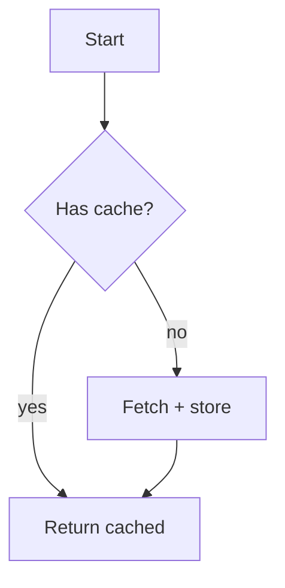
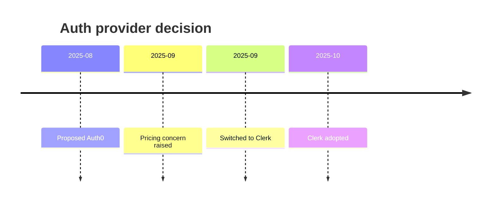
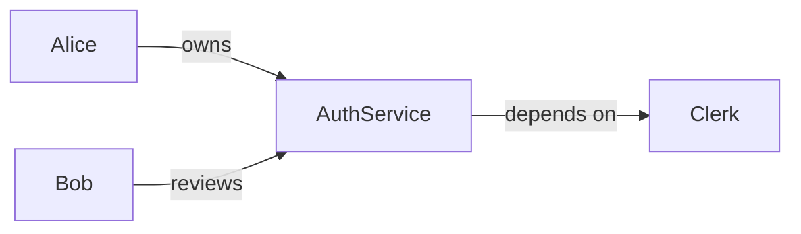

# Mermaid Cheat Sheet

Use fenced ` ```mermaid ` blocks when a diagram clarifies relationships, flow, or evolution over time.

## When to use
- Flow / process → `flowchart`
- Evolution over time → `timeline`
- Entity relationships → `graph LR`

## Syntax basics

### Flowchart


### Timeline


### Relationship graph (LR = left-to-right)


## Rules
- Keep diagrams ≤ 12 nodes. Larger graphs hurt readability.
- Label every edge in `graph`/`flowchart`.
- Do NOT put `[src:...]` tags inside the mermaid block — place them in the surrounding prose.
- Always put the fenced block on its own paragraph; never inside a list item.
